# Rust 的所有权和借用增强内存安全

> - 原文：[Rust’s Ownership and Borrowing Enforce Memory Safety](https://towardsdata.dev/rust/2022/ownership-and-borrowing)

Rust 的所有权和借用特性防止我们遇到与内存相关的问题。
如果我们不了解到底发生了什么，Rust 的所有权和借用可能会令人困惑。当将以前学习的编程风格应用到新的范例时尤其如此；我们称之为范式转变（paradigm shift）。所有权是一个新颖的想法，一开始很难理解，但是随着我们研究得越多，它就会变得更容易。

在我们进一步讨论 Rust 的所有权和借用之前，我们首先了解什么是内存安全和内存泄漏以及编程语言如何处理它们。

## 内存安全

内存安全是指软件应用程序的状态，其中内存指针或引用总是指向有效的内存。因为内存损坏总是可能会发生的，所以如果程序不是内存安全的，它的行为几乎没有保证。
简单地说，如果一个程序不是真正的内存安全的，那么它的功能几乎没有保证。当处理内存不安全的程序时，恶意方可以使用该漏洞读取机密或在其他人的机器上执行任意代码。

让我们用一个伪代码来看看什么是有效内存：

```ts
// pseudocode #1 - shows valid reference
{ // scope starts here
  int x = 5
  int y = &x
} // scope ends here
```

在上面的伪代码中，我们创建了一个值为`10`的变量`x`。我们使用`&`操作符或关键字来创建一个引用。
因此，`&x`语法让我们创建一个引用`x`值的引用。简而言之，我们创建了一个拥有`5`的变量`x`和一个引用`x`的变量`y`。

由于变量`x`和`y`都在同一块或作用域内，因此变量`y`具有引用`x`值的有效引用。因此，变量`y`的值就是`5`。

看看下面的伪代码：

```ts
// pseudocode #2 - shows invalid reference aka dangling reference
{ // scope starts here
  int x = 5
} // scope ends here
int y = &x // can't access x from here; creates dangling reference
```

正如我们所见，`x`的作用域仅限于创建它的块中。当我们尝试在其作用域之外访问`x`时，我们会遇到悬空引用。
悬空引用……？它到底是什么？

### 悬空引用

悬空引用是一个指向某个内存位置的指针，该位置已被其他数据占据或者已被释放掉了（freeed）。如果程序（又名进程）引用已释放或擦除的内存，它可能会崩溃或导致不确定的结果。

话虽如此，内存不安全是某些编程语言的一个属性，它允许程序员处理无效数据。因此，内存不安全引入了各种问题，可能会导致以下主要安全漏洞：

* 越界读取    （Out-of-bounds Reads）
* 越界写入    （Out-of-bounds Writes）
* 释放后使用   （Use-After-Free）

内存不安全导致的漏洞是许多其他严重安全威胁的根源。发现这种漏洞对开发人员来说还是比较困难的。

## 什么是内存泄漏？

了解什么是内存泄漏及其后果很重要。

内存泄漏是一种无意的内存消耗形式，开发人员无法在不再需要时释放已分配的堆内存块。这与内存安全完全相反。稍后会详细介绍不同的内存类型，但现在，只知道堆栈存储在编译时已知的固定长度变量，而稍后在运行时可能更改的变量的大小必须放在堆上。

与堆内存分配相比，堆栈内存分配被认为更安全，因为当内存不再相关或不再需要时，由程序员或程序运行时本身自动释放。

但是，当程序员在堆上生成内存并且在没有垃圾收集器的情况下无法将其删除时（在 C 和 C++ 的情况下），就会发生内存泄漏。此外，如果我们在没有释放该内存的情况下丢失了对一块内存的所有引用，那么我们就会发生内存泄漏。我们的程序将继续拥有该内存，但无法再次使用它。

> 一点点的内存泄漏不是问题，但如果程序分配了大量内存并且从未释放它，程序的内存占用量将继续增加，从而导致拒绝服务。

当程序退出时，操作系统会立即收回它拥有的所有内存。因此，内存泄漏只会影响正在运行的程序；一旦程序终止，它就没有效果。

让我们回顾一下内存泄漏的主要后果。

内存泄漏通过减少可用内存（堆内存）的数量来降低计算机的性能。它最终会导致整个或部分系统停止正常工作或严重减速。崩溃通常与内存泄漏有关。

我们找出如何防止内存泄漏的方法会因我们使用的编程语言而异。
**内存泄漏开始时可能只是一个小问题，几乎是“不引人注意的问题”，但它们会迅速升级并使所影响的系统不堪重负**。在可行的情况下，我们应该留意它们并采取行动纠正它们，而不是任其发展


## 内存不安全与内存泄漏
内存泄漏和内存不安全是在预防和修复方面最受关注的两类问题。重要的是要注意修复一个不会自动修复另一个。

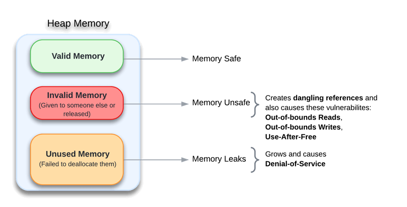

## 内存类型
内存可以分为四种不同的类型：处理器寄存器、静态变量、堆栈和堆。这些内存类型在程序中都起着不同的作用：

### 处理器寄存器（Processor register）
处理器寄存器是位于 CPU 内部的一组高速存储器，用于保存正在执行中的指令、数据和地址等信息，供 CPU 快速读写使用。由于处理器寄存器的工作频率非常高，因此能够提高程序的运行效率。在 Rust 中，通常使用基本数据类型（比如整数和浮点数）时，会将其存储在处理器寄存器中进行计算，以达到最佳的性能。

```rust
fn main() {
    let a: u32 = 3;
    let b: u32 = 4;
    let c = a + b;
    println!("{} + {} = {}", a, b, c);
}
```

变量`a`和`b`都被存储在处理器寄存器上进行加法计算，最后结果存储在 CPU 的寄存器中。

### 静态变量（Static）

静态变量指的是在程序编译期间就已经分配好内存，并且生命周期与整个程序运行周期相同的变量。当程序第一次运行时，静态变量将被初始化，并在不同的函数之间共享。

静态变量必须是线程安全的。因此，指定的类型必须实现 sync trait。将变量设置为非线程安全类型的静态变量可能会导致数据竞争条件。

尽管静态变量不能替代常量变量，但 Rust 建议总是优先使用常量，除非：

- 您需要存储大量数据。
- 你需要内部可变性
- 您需要静态变量的单地址性质。

静态变量通常用于记录全局状态信息或是保留上一次函数调用的值，可以在需要时进行修改和访问。
在 Rust 中，使用 `static` 关键字可以声明静态变量，并在需要时进行调用。

```rust
// Rust Create Static Variable
static MAX_COUNT: i32 = 100;

fn print_count() {
    println!("Maximum count is {}", MAX_COUNT);
}

fn main() {
    // Rust Create Static Variable
    let hello: &'static str = "Hello";
    print_count();
}
```

使用了静态变量`MAX_COUNT`存储最大计数值，其生命周期与整个程序运行周期相同，因此可以被多个函数共享。

### 堆栈（Stack）

堆栈按照接收数据的顺序存储数据，并按照相反的顺序删除数据。可以按照后进先出（Last In First Out）的顺序从堆栈中访问项。向堆栈中添加数据称为 push，从堆栈中删除数据称为 pop。

它由栈指针（stack pointer）和栈帧（stack frame）组成。堆栈管理着程序执行时所用的临时数据和函数调用的信息。当函数被调用时，其局部变量和参数等数据会被压入栈帧中，栈指针也会向下移动，而当函数返回时，栈帧和其中的数据都会被弹出，栈指针也会向上移动。

这种后进先出（Last-In-First-Out, LIFO）的管理方式使得栈非常高效，但它的大小有限，通常只有几 MB 到几十 MB 不等。
当函数执行完毕后，这些信息将被弹出，栈恢复到原来的大小。栈具有很好的局部性特性，可以有效地提高缓存命中率和程序运行效率。

作为开发人员，我们不必担心堆栈内存分配和释放；堆栈内存的分配和释放由编译器“自动完成”。这意味着当堆栈上的数据不再相关（超出范围）时，它会自动删除而无需我们干预。

这种内存分配也称为临时内存分配，因为一旦函数执行完毕，属于该函数的所有数据都会“自动”刷新出堆栈。

> 在 Rust 中，栈上存储的数据必须要满足编译期可确定大小的要求，这也就意味着 Rust 中的所有原始类型都存在于堆栈中。数字、字符、切片、布尔值、固定大小的数组、包含基元的元组和函数指针等类型都可以位于堆栈上。

```rust
fn main() {
    let x: i32 = 5;
    let y: i32 = 6;
    let sum = add(x, y);
    println!("{} + {} = {}", x, y, sum);
}

fn add(a: i32, b: i32) -> i32 {
    let c = a + b;
    c
}
```

这个例子中，变量`x`和`y`被存储在栈上作为参数传递到`add`函数中，执行完函数后，变量`sum`也会被存储在栈上，最后结果被打印出来。


### 堆（Heap）

与栈不同的是，当我们把数据放到堆上时，我们会申请一定的空间。**内存分配器在堆中定位一个足够大的未占用位置，将其标记为正在使用（in use），并返回对该位置地址的引用。这称为分配**。

在堆上分配内存比在栈上分配要慢，因为堆的分配器总是需要查找一个空的位置来存储新数据。此外，由于我们必须通过指针才能访问堆上的数据，所以堆上的数据访问速度较慢。与在编译时进行分配和释放的栈不同，堆内存在程序执行期间动态地进行分配和释放。

堆内存的分配和释放不受函数调用栈的影响，因此可以用于存储跨函数或者跨线程共享的数据结构。通常需要手动申请和释放堆内存空间，并且存储在堆上的数据没有固定的生命周期。

> 在某些编程语言中，要分配堆内存，我们会使用关键字 new。这个新关键字（又名操作符）表示在堆上分配内存的请求。如果堆上有足够的可用内存，则 new 操作符会初始化内存并返回新分配内存的唯一地址。

但是，由于堆内存的管理需要程序员手动参与，并且容易出现内存泄漏、野指针等问题，需要开发人员注意内存的生命周期和所有权关系。
由于堆的大小可以在程序运行时动态地扩展或缩小，因此它的灵活性比栈更强。

在 Rust 中，可以使用 `Box` 类型进行堆内存的动态分配和释放。

```rust
fn main() {
    let name = String::from("World");
    print_greeting(name);
}

fn print_greeting(name: String) {
    println!("Hello, {}!", name);
}
```

在这个例子中，字符串`name`被存储在堆上，并将其作为参数传递给`print_greeting`函数。而在函数执行完毕后，由于该字符串的生命周期不受调用函数的影响，因此垃圾回收器会自动释放该内存空间。

在计算机硬件中，堆栈通常是由 CPU 中的栈指针寄存器来实现的，当程序执行函数调用和返回时，栈指针会指向相应的内存地址。而堆则是由操作系统在进程的虚拟地址空间中动态地分配内存。
操作系统通常提供一系列系统调用（例如 brk 和 mmap ）来管理堆的内存。

## 各种编程语言如何保证内存安全？

在内存管理方面，尤其是堆内存方面，我们希望我们的编程语言具有以下特征：

* 尽快释放不再需要的内存，而且没有运行时开销。
* 永远不应该保持对已经释放的数据的引用（也称为悬空引用）。否则，可能会发生崩溃和安全问题。

编程语言通过以下方式以不同方式确保内存安全：

- 显式内存释放（Explicit memory deallocation ）（由 C、C++ 采用）
- 自动或隐式内存释放（Automatic or implicit memory deallocation）（由 Java、Python 和 C# 采用）
- 基于区域的内存管理（Region-based memory management）
- 线性或独特类型系统（Linear or unique type systems）

### 显式的内存释放
在采用显式内存回收的语言中（如 C、C++），程序员必须手动调用特定函数来释放不再需要的内存。这种方式在没有垃圾回收机制的情况下是必需的，但是它也容易导致一些常见的内存错误（如使用已经被释放的内存）。

示例代码：

```c++
int *p = new int; //动态分配内存
*p = 10;
delete p; // 手动释放内存
```


### 自动或隐式内存释放

在采用隐式内存回收的语言中（如 Java、Python、C#），程序员无需手动回收内存，而是由语言的垃圾回收机制自动完成。当一个对象不再被引用时，垃圾回收机制会自动识别并释放其占用的内存。这种方式简化了编程过程，但是可能会导致不可预测的系统行为和性能问题。

示例代码：

```python
a = [1, 2, 3] # 创建列表对象
a = None # 删除引用
```


### 基于区域的内存管理

基于区域的内存管理 (Region-based Memory Management) 是 Rust 中的一种内存分配方式，其实现了自动内存管理，可以让代码具有高度可靠性和灵活性。它将未释放的内存分配请求限制在特定区域内，一旦该区域的作用域结束，就会自动释放内存。这样的做法可以有效减少内存中由于应用程序错误导致的悬挂指针问题、use after free 等问题，提供一种更高效的内存管理解决办法。

示例：

```rust
fn main() {
    let s = "Hello World"; // 一个字符串区域
    {
        let s2 = "Goodbye"; // 另一个字符串区域
    } // s2 的生命周期结束，内存被自动释放
} // s 的生命周期结束，内存被自动释放
```

上面这段代码中，变量`x`是使用`String::from()`函数在堆上分配内存并存储字符串数据，所以 `x` 对象的生命周期从分配开始到内存释放结束。而变量`y`是对`x`的引用。由于`x`和`y`的生命周期被限制为当前作用域，所以一旦作用域结束，Rust 就能自动地清理掉`x`以及相关的内存。

### 线性类型系统

#### 线性类型 vs 非线性类型
"线性类型"的名称源自于这种类型系统中与值相关的“使用次数”。在Rust的线性类型系统中，每个变量或对象只能被使用一次，这意味着每个值被使用且只被使用一次，它与其他值之间是没有共享的，所以也就不存在别名问题。

与之相反的是，非线性类型系统允许多个变量指向同一个值，从而可以对同一值进行多次操作，并可能导致悬垂指针和内存泄漏等问题。在这种情况下，我们不能准确地跟踪值的所有权和生命周期，因此也就无法保证程序的安全性和正确性。

因此，相较于非线性类型系统，线性类型系统更严格，要求每个值只能被使用一次，这样就可以避免出现许多常见的编程错误。同时，它还强制编写者显式处理数据的生命周期和所有权，从而提高了程序的可读性和可维护性。

#### Rust 中的线性类型系统
线性类型系统 (Linear Type System) 则是一种控制变量使用和拷贝数目的方法。
这种变量行为的限制，使得编译器能够保证变量在使用时不会发生无效操作。
线性类型的作用在于：**在移交资源的时候必须进行所有权的转移，从而清楚地确定这个资源到底属于谁**。
这个特性被称为 "单一所有权"（Single Ownership），它可以确保在程序中用到的每个资源（如内存、文件句柄等）最多被占用一次。

**在 Rust 中，标记为线性类型的变量只能被绑定一次，一旦赋值或传递给其他函数则不能再次使用**。
因此，由于 Rust 中线性类型的主要特征是单一所有权和资源的独占使用，所以这些类型被称为线性类型。

例如，在下面的例子中，我们将变量 `x` 绑定到一个 `Vec<i32>` 类型的对象上，然后通过 `move` 关键字将所有权转移给函数，并获得返回值：

```rust
fn consume(x: Vec<i32>) -> i32 {
    let y = x;
    y[0]
}

fn main() {
    let v = vec![1, 2, 3];
    let r = consume(v);
    println!("{}", r); // output: 1
    println!("{}", v[0]); // "value borrowed here after move`"
}
```

在这个例子中，一旦我们调用了 `consume` 函数，变量 `v` 就无法再次访问了，因为它的所有权已经转移给了函数 `consume`。如果我们尝试访问变量 `v`，编译器会报错提示该值早已经被 move 了。

基于区域的内存管理和线性类型系统都是 Rust 语言中用来确保内存安全和避免数据竞争的有力机制。
这两种机制的优势在于应用了借用的关系来主动做出约束，使得开发者在编写代码时能更清晰地知道何时会发生数据竞争或内存泄漏等问题，提高了程序的可读性和可维护性，并且保证代码的运行安全性。

### 手动或显式内存释放

在使用显式内存管理时，程序员必须“手动（manually）”释放或擦除分配的内存。 “释放（deallocation）”操作符（例如，C 中的`delete`）存在于具有显式内存释放的语言中。

> 垃圾收集在 C 和 C++ 等系统语言中成本太高，因此显式内存分配继续存在。

将释放内存的责任留给程序员的好处是让程序员可以完全控制变量的生命周期。但是，如果释放操作符使用不当，在执行过程中可能会出现软件故障。事实上，这种人工分配和释放的过程很容易出错。一些常见的编码错误包括：

* 悬空引用
* 内存泄漏

尽管如此，我们更喜欢手动内存管理而不是垃圾回收，因为它可以提供更多的控制和更好的性能。需要注意的是，任何系统编程语言的目标都是尽可能地接近底层硬件。换句话说，在权衡中，他们更倾向于更好的性能而非方便的功能。

> 这由开发人员完全负责确保没有释放值的指针被再次使用。

最近，有几种经过验证的模式可以避免这些错误，但归根结底是要保持严格的代码纪律，这需要始终如一地应用正确的内存管理方法。

关键要点是：

* 更好地控制内存管理。
* 悬空引用和内存泄漏导致安全性降低。
* 导致更长的开发时间。

### 自动或隐式内存释放
自动内存管理已成为所有现代编程语言（包括 Java）的基本特性。

在自动内存释放的情况下，垃圾收集器充当自动内存管理器。这些垃圾收集器定期遍历堆并回收未使用的内存块。它们代表我们管理内存的分配和释放。所以我们不必编写代码来执行内存管理任务。这很好，因为垃圾收集器将我们从内存管理的责任中解放出来。另一个优点是它减少了开发时间。

另一方面，垃圾收集有许多缺点。在垃圾收集期间，程序应该暂停并花时间确定在继续之前需要清理的内容。

此外，自动内存管理具有更高的内存需求。这是因为垃圾收集器为我们执行内存释放，这会消耗内存和 CPU 周期。因此，自动内存管理可能会降低应用程序性能，尤其是在资源有限的大型应用程序中。

关键要点是：

* 无需开发人员手动释放内存。
* 提供高效的内存安全，没有悬空引用或内存泄漏。
* 更简单直接的代码。
* 更快的开发周期。
* 对内存管理的控制较少。
* 会导致延迟，因为它会消耗内存和 CPU 周期。

## Rust 如何保证内存安全？

一些语言提供垃圾回收，在程序运行时寻找不再使用的内存；其他的则需要程序员显式地分配和释放内存。这两种模型都有优点和缺点。垃圾收集虽然可能是最广泛使用的，但也有一些缺点；它以牺牲资源和性能为代价使开发人员的生活变得轻松。

话虽如此，一个提供了高效的内存管理控制，而另一个通过消除悬挂引用和内存泄漏提供了更高的安全性。 Rust 结合了两者的优点。

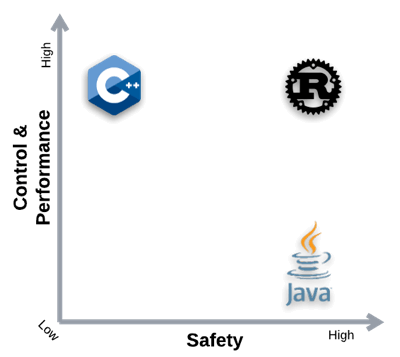

Rust 采用了与其他两种不同的方法，它基于具有一组规则的所有权模型，编译器验证这些规则以确保内存安全。如果违反了这些规则中的任何一条，程序将不会编译。实际上，所有权用编译时的内存安全检查取代了运行时垃圾收集。

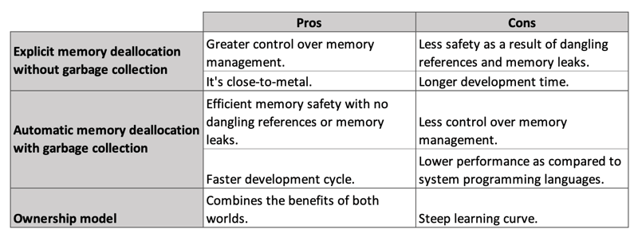

适应所有权需要一些时间，因为这对许多程序员来说是一个新概念。

## 所有权

至此，我们对数据在内存中的存储方式有了基本的了解。让我们更仔细地看看 Rust 中的所有权。 Rust 最大的显着特征是所有权，它确保了编译时的内存安全。

首先，让我们从最字面的意义上定义 “所有权”。所有权是 “拥有” 和 “控制” 合法占有 “某物” 的状态。话虽如此，我们必须确定所有者是谁以及所有者拥有和控制什么。
**在 Rust 中，每个值都有一个称为其所有者的变量。简单来说，变量就是所有者，变量的值就是所有者拥有和控制的东西**。

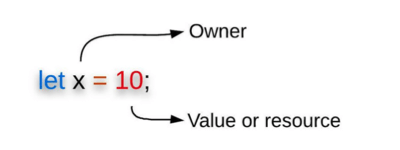

使用所有权模型，一旦拥有它的变量超出作用域，内存就会自动释放（释放）。**当值超出作用域或由于其他原因它们的生命周期结束时，将调用它们的析构函数**。析构函数，特别是自动析构函数，是一种通过删除引用并释放内存来从程序中删除值痕迹的函数。

### 借用检查器

Rust 通过借用检查器（一个[静态分析器](https://en.wikipedia.org/wiki/Static_program_analysis)）实现所有权。借用检查器是 Rust 编译器中的一个组件，它跟踪数据在整个程序中的使用位置，并且通过遵循所有权规则，它能够确定需要释放数据的位置。此外，借用检查器确保在运行时永远不会访问释放的内存。它甚至消除了由并发突变引起的数据竞争的可能性。

### 所有权规则

如前所述，所有权模型建立在一组称为所有权规则的规则之上，这些规则相对简单。Rust 编译器 (rustc) 强制执行这些规则：

* 每个值都有一个称为其所有者的变量。
* 一个值在同一时刻只能有一个所有者。
* 当所有者离开作用域时，其拥有的值将被丢弃。

以下内存错误受这些编译时检查所有权规则的保护：

- **悬空引用（Dangling references）**：在这种情况下，一个引用指向的内存地址不再包含指针所指向的数据；该指针指向空数据或随机数据。

- **释放后使用（Use after frees）**：内存被释放后被访问，这种情况可能会崩溃。这个内存位置也可以被黑客用来执行代码。

- **双重释放（Double frees）**：这是分配的内存被释放，然后再次释放。这可能导致程序崩溃，暴露敏感信息。这也允许黑客运行任何代码。

- **分段错误（Segmentation faults）**：程序试图访问不允许访问的内存区域。

- **缓冲区溢出（Buffer overrun）**：数据量超过内存缓冲区的存储容量，导致程序崩溃。

在深入了解每个所有权规则的细节之前，了解复制、移动和克隆之间的区别（区别）很重要。

#### 复制（copy）

固定大小的类型（特别是基本类型）可以存储在堆栈中，并在其范围结束时弹出（popped off），如果代码的另一部分需要在不同作用域中使用相同的值，则可以快速轻松地复制该类型以创建新的独立变量。**因为复制堆栈内存既便宜又快速，所以具有固定大小的基本类型具有复制语义**。它可以廉价地制造一个完美的复制品。

> 需要值得注意的是，具有固定大小的基本（原始）类型已经实现了 copy 特性，可以方便进行复制。

```rust
let x = "hello";
let y = x;
println!("{}", x) // hello
println!("{}", y) // hello
```

因为`x`存储在堆栈中，复制它的值来为`y`生成一个副本是非常容易的。而对于存储在堆上的值，情况就不同了。这是堆栈帧（stack frame）的样子：

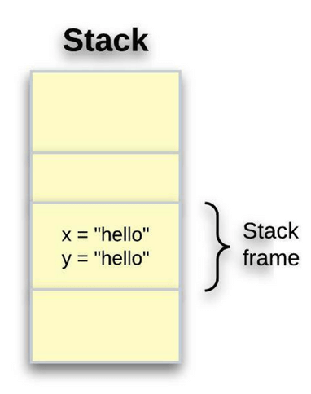


#### 移动（move）
在 Rust 术语中，“移动” 意味着内存的所有权被转移（转移）给另一个所有者。考虑存储在堆上的复杂类型的情况。

```rust
let s1 = String::from("hello");
let s2 = s1;
```

我们假设第二行（即`let s2 = s1;`）会复制`s1`中的值并将其绑定到`s2`。但实际情况并非如此。

现在来看看，在 String 背后发生了什么：

一个 String 其实由三个部分组成，存储在栈中。实际的内容（本例中是`hello`）存储在堆上。

- **指针（Pointer）** - 指向了存储字符串内容的内存。
- **长度（Length）** - 它是 String 的内容当前使用的内存量（以字节（bytes）为单位）。
- **容量（Capacity）** - 这是 String 从分配器（allocator）接收到的内存总量，以字节为单位。

换句话说，元数据（metadata）保存在堆栈中，而实际数据保存在堆中。

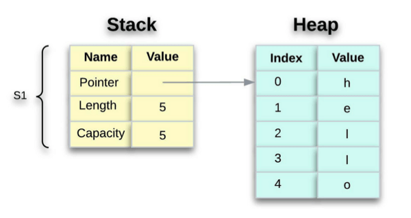

当我们将`s1`分配给`s2`时，将复制`String`元数据，这意味着我们复制堆栈上的指针、长度和容量。我们不复制指针指向的堆上的数据。内存中的数据表示如下所示：

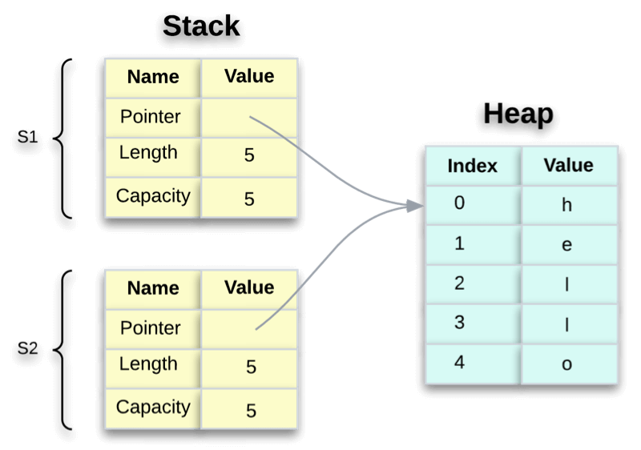

如果 Rust 把堆的数据也复制了，那么内存就会是下图这样。如果 Rust 这样做的话，假设堆上的数据很大，那么`s2 = s1`操作在运行时性能方面可能会非常慢。

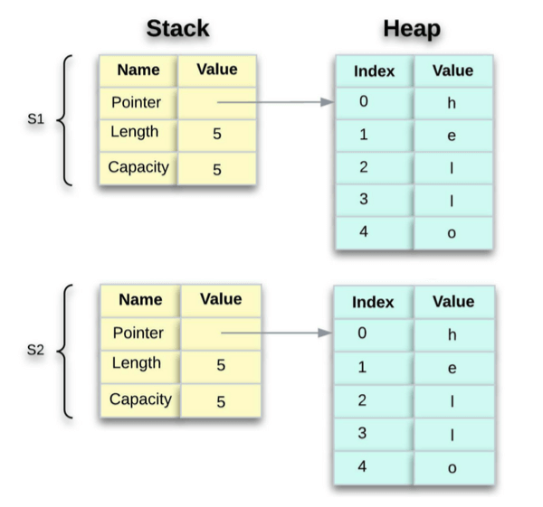

请注意，当复杂类型不再在作用域中时，Rust 将调用`drop`函数来显式释放堆内存。图 6 中的两个数据指针都指向同一个位置，而实际上 Rust 不会这样，稍后会详细介绍。

如前所述，当我们将`s1`分配给`s2`时，变量`s2`会得到`s1`的元数据（指针、长度和容量）副本。但是一旦分配给`s2`，`s1`会发生什么？ Rust 不再认为`s1`有效。是的，你没看错。

让我们考虑一下这个`let s2 = s1`赋值。考虑一下如果 Rust 在这个赋值之后仍然认为`s1`有效会发生什么。当`s2`和`s1`超出作用域时，它们会尝试释放同一块内存。呃，这下就出问题了。这就是所谓的**双重释放**错误，它是内存安全错误之一。两次释放内存可能导致内存损坏，从而带来安全风险。

为了确保内存安全，Rust 认为在`let s2 = s1`这行之后的`s1`是无效的。因此，当`s1`不再在作用域内时，Rust 不需要释放任何东西。检查如果我们在创建`s2`之后尝试使用`s1`会发生什么。

```rust
fn main() {
    let s1 = String::from("hello");
    let s2 = s1;

    println!("{}, world!", s1);  // Won't compile. We'll get an error.
}
```

会收到错误`^^ value borrowed here after move`，因为 Rust 会阻止您使用无效的引用。

Rust 在`let s2 = s1`行之后将`s1`的内存所有权 “移动” 到`s2`时，它认为`s1`无效。这是`s1`失效后的内存表示：


当只有`s2`保持有效时，它会在超出作用域时单独释放内存。所以 Rust 消除了出现双重释放错误的可能性！

#### 克隆（clone）

如果我们确实想深度复制 String 的堆数据，而不仅仅是栈数据，我们可以使用一个叫做`clone`的方法。以下是如何使用克隆方法的示例：

```rust
fn main() {
    let s1 = String::from("hello");
    let s2 = s1.clone();

    println!("s1 = {}, s2 = {}", s1, s2);
}
```

使用克隆方法时，堆数据确实会复制到`s2`中。这完美地工作并产生以下行为：


使用`clone`方法有严重的后果；它不仅复制了数据，而且也没有在两者之间同步任何变化。一般来说，克隆应该仔细计划，并充分意识到后果。
到目前为止，我们应该能够区分复制（copy）、移动（move）和克隆（clone）。现在让我们更详细地了解每个所有权规则。

### 所有权规则 1

每个值都有一个称为其所有者的变量。它意味着所有的值都是由变量拥有的。

在下面的示例中，变量`s`拥有指向字符串的指针，在第二行中，变量`n`被授予了值`1`的所有权。

```rust
let s = String::from("Rule 1");
let n = 1;
```


### 所有权规则 2
在给定的时间内，一个值只能有一个所有者。一个人可以有很多宠物，但当涉及到所有权模型时，在任何给定的时刻只有一个值😜。

让我们看一下使用基本类型的示例，这些基本类型在编译时是固定大小的。

```rust
fn main() {
    let x = 10;
    let y = x;
    let z = x;
}
```

这应该被解释为变量`x`拥有数值`10`，然后通过`let y = x;`，变量`x`拥有的数值的一个新副本被创建并移交给变量`y`拥有，还同样把它分配给`z`。

我们知道在给定时间只能有一个所有者，但在这里没有收到任何错误。
因为在这里，我们每次把`x`赋值给一个新变量时，编译器都会复制`x`。

此堆栈帧如下所示：`x = 10`、`y = 10`和`z = 10`。
然而，这似乎不是这样的情况:`x = 10`、`y = x`和`z = x`。
正如我们所知，`x`是这个值`10`的唯一所有者，`y`和`z`都不能拥有这个值。

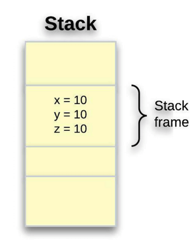

==由于复制堆栈内存既便宜又快速，因此具有固定大小的基本类型被称为具有复制语义，而复杂类型则移动所有权==，如前所述。因此，在这种情况下，编译器会生成副本。

此时，[变量绑定](https://en.wikipedia.org/wiki/Name_binding)的行为与其他编程语言类似。为了说明所有权规则，我们需要一个复杂的数据类型。

让我们看看存储在堆上的数据，看看 Rust 是如何知道什么时候去清理它的； String 类型是一个很好的例子。我们将重点关注 String 的所有权相关行为；这些原则也适用于其他复杂数据类型。

我们知道，复杂类型在堆上管理数据，其内容在编译时是未知的。让我们看一下之前看到的同一个例子

```rust
fn main(){
    let s1 = String::from("hello");
    let s2 = s1;

    println!("{}, world!", s1);  // Won't compile. We'll get an error.
}
```

> 对于 String 类型来说，存储在堆上的大小可能会扩展。这意味着：
>
> * 在运行时，必须从内存分配器请求内存（我们称之为第一部分）。
> * 当使用完 String 后，我们需要将这些内存返回（释放）给分配器（我们称之为第二部分）。
>
> 开发人员负责第一部分：当我们调用`String::from`时，会请求它需要的内存。这部分在编程语言中几乎是通用的。
>
> 但是，第二部分不同。在带有垃圾收集器(GC)的语言中，GC 跟踪并清理不再使用的内存，我们不必担心它。
> 在没有垃圾回收器的语言中，我们需要识别何时不再需要内存，并要求显式地释放内存。正确地做到这一点一直是一项具有挑战性的编程任务：
>
> * 如果我们忘记了，就会浪费内存。
> * 如果我们做得太早，就会得到一个无效的变量。
> * 如果我们做两次，就会得到一个 bug。
>
> Rust 以一种新颖的方式处理内存释放，使我们的生活更轻松：一旦拥有内存的变量超出作用域，内存就会自动返回。

让我们回到正题。在 Rust 中，对于复杂类型，诸如为变量赋值、将其传递给函数或从函数返回它等操作不会复制值：而只是移动它。简单地说，复杂类型移动所有权。

> 当复杂类型不再在作用域内时，Rust 将调用`drop`函数显式地释放堆内存。

### 所有权规则 3

当所有者超出范围时，该值将被删除。再考虑一下前面的情况：

`s1`的值在将`s1`赋值给`s2`之后（在`let s2 = s1`语句之后）被释放掉。因此，`s1`在这次赋值后不再有效。这是删除`s1`后的内存表示：

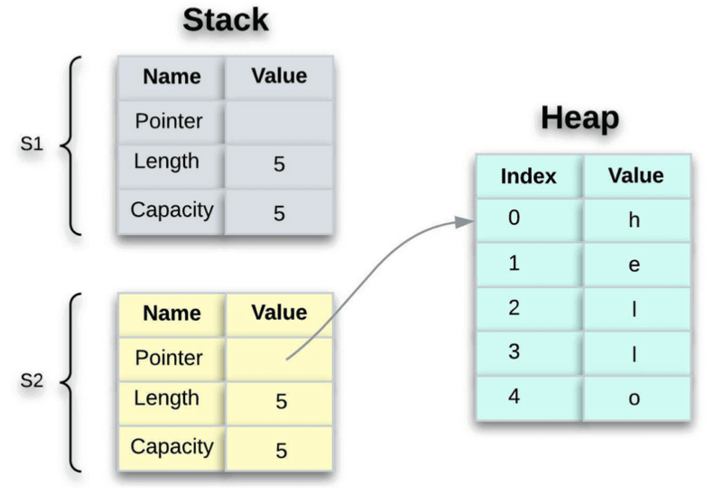

### 所有权如何移动（move）

在 Rust 程序中，可以通过三种方式将所有权从一个变量转移到另一个变量：

1. 将一个变量的值赋给另一个变量（已经讨论过了）。
2. 将值传递给函数。
3. 从函数返回。

#### 将值传递给函数

将值传递给函数具有类似于将值赋给变量的语义。就像赋值一样，将变量传递给函数会导致它移动或复制。看下这个例子，它显示了复制和移动用例：

```rust
fn main() {
    let s = String::from("hello");  // s comes into scope

    move_ownership(s);              // s's value moves into the function...
                                    // so it's no longer valid from this
																		// point forward

    let x = 5;                      // x comes into scope

    makes_copy(x);                  // x would move into the function
                                    // It follows copy semantics since it's
																		// primitive, so we use x afterward

} // Here, x goes out of scope, then s. But because s's value was moved, nothing
  // special happens.


fn move_ownership(some_string: String) { // some_string comes into scope
    println!("{}", some_string);
} // Here, some_string goes out of scope and `drop` is called.
  // The occupied memory is freed.


fn makes_copy(some_integer: i32) { // some_integer comes into scope
    println!("{}", some_integer);
} // Here, some_integer goes out of scope. Nothing special happens.
```

如果我们在调用`move_ownership`之后尝试使用`s`，Rust 会抛出一个编译时错误。

#### 从函数返回

返回值也可以转移所有权。下面的示例显示了一个返回值的函数，其注释与上一个示例中的相同。

```rust
fn main() {
    let s1 = gives_ownership();         // gives_ownership moves its return
                                        // value into s1

    let s2 = String::from("hello");     // s2 comes into scope

    let s3 = takes_and_gives_back(s2);  // s2 is moved into
                                        // takes_and_gives_back, which also
                                        // moves its return value into s3
} // Here, s3 goes out of scope and is dropped. s2 was moved, so nothing
  // happens. s1 goes out of scope and is dropped.


fn gives_ownership() -> String {             // gives_ownership will move its
                                             // return value into the function
                                             // that calls it

    let some_string = String::from("yours"); // some_string comes into scope

    some_string                              // some_string is returned and
                                             // moves out to the calling
                                             // function
}


// This function takes a String and returns it
fn takes_and_gives_back(a_string: String) -> String { // a_string comes into
                                                      // scope

    a_string  // a_string is returned and moves out to the calling function
}
```

变量的所有权始终遵循相同的模式：当一个值被分配给另一个变量时，它会被移动。除非数据的所有权已移至另一个变量，否则当包含堆上数据的变量超出作用域时，该值将通过`drop`清除。

希望这能让我们对所有权模型是什么、以及它如何影响 Rust 处理值的方式有一个基本的了解，比如将它们相互赋值，并将它们传入和传出函数。

稍等。还有一件事…

和所有好的事物一样，Rust的所有权模型也有一定的缺点。一旦我们开始使用 Rust，我们很快就意识到某些不便。我们可能已经注意到，在每个函数中获取所有权然后返回所有权有点不方便。

而且烦人的是，如果我们想再次使用它，除了该函数返回的任何其他数据之外，还必须返回我们传递给函数的所有内容。如果我们想让一个函数使用一个值而不获取它的所有权该怎么办？

考虑以下示例。下面的代码将导致错误，因为一旦所有权转移（转移）到`print_vector`函数，变量`v`就不能在最初拥有它的`main`函数（在`println!`中）中使用了。

```rust
fn main() {
   let v = vec![10,20,30];
   print_vector(v);
   println!("{}", v[0]); // this line gives us an error
}

fn print_vector(x: Vec<i32>) {
   println!("Inside print_vector function {:?}",x);
}
```

跟踪所有权似乎很容易，但是当我们开始处理大型和复杂的程序时，它会变得很复杂。因此，我们需要一种在不转移所有权的情况下转移值的方法，这就需要用到借用的概念。

## 借用（Borrowing）

借用，从字面意义上讲，指的是接受某物并承诺归还。在 Rust 的上下文中，借用是一种访问值而不声明其所有权的方式，因为它必须在某个时候归还给其所有者。

==当借用一个值时，需要使用`&`操作符引用它的内存地址。`&`称为引用。引用本身没什么特别的，它们只是指向了地址==。对于那些熟悉 C 指针的人来说，引用是指向内存的指针，该内存包含属于另一个变量的值（即由另一个变量拥有的值）。值得注意的是，在 Rust 中引用不能为空（null）。

实际上，引用就是一个指针；它是最基本的指针类型。大多数语言中只有一种类型的指针，但 Rust 有不同类型的指针，而不仅仅是一种。指针和它们的种类是另一个主题了，在这里就不多说了。

简单来说，Rust ==将创建对某个值的引用称为借用该值==，该值最终必须归还给它的所有者。

让我们看下面的一个简单示例：

```rust
fn main() {
    let x = 5;
    let y = &x;

    println!("Value y={}", y);
    println!("Address of y={:p}", y);
    println!("Deref of y={}", *y);
}
```

这里，`y`变量借用（borrows）变量`x`拥有的数字，`x`仍然拥有该值。我们将`y`称为对`x`的引用（reference）。当`y`超出作用域时借用结束，因为`y`不拥有该值，所以它不会被销毁。要借用一个值，请使用`&`操作符进行引用。`p`格式，`{:p}`输出为以十六进制（hexadecimal）表示的内存位置。

> 解引用（Dereference）：在上面的代码中，`*`（即星号）是对引用变量进行操作的 解引用操作符。解引用操作符允许我们获取存储在指针内存地址中的值。(to get the value stored in the memory address of a pointer.)

接下来看看一个函数如何通过借用，在不获得所有权的情况下操作一个值：

```rust
fn main() {
   let v = vec![10,20,30];
   print_vector(&v);
   println!("{}", v[0]); // can access v here as references can't move the value
}

fn print_vector(x: &Vec<i32>) {
   println!("Inside print_vector function {:?}", x);
}
```

我们将引用`&v`（也称为按引用传递 aka pass-by-reference）传递给`print_vector`函数，而不是转移所有权（例如 按值传递）。这样在`main`函数中调用`print_vector`函数后，还可以访问`v`。

### 使用解引用操作符跟踪指向值的指针

如前所述，引用是一种指针，指针可以被认为是指向存储在别处的值的箭头。考虑以下示例：

```rust
fn main() {
    let x = 5;
    let y = &x;

    assert_eq!(5, x);
    assert_eq!(5, *y);
}
```

在上面的代码中，我们创建了对 i32 类型值的引用，然后使用解引用操作符跟踪（follow）对数据的引用。变量`x`持有一个`i32`类型的值`5`。设置`y`为对`x`的引用。

这是堆栈内存的显示方式：

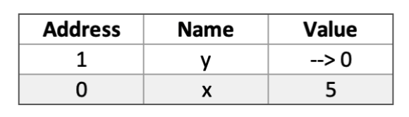

可以断言`x`等于`5`。但如果想对`y`中的值进行断言，就必须使用`*y`遵循对它所引用的值的引用（因此此处解引用）。一旦解引用`y`，就可以访问`y`指向的整数值，与`5`进行比较。

如果尝试改写`assert_eq!(5, y);` ，会出现以下编译错误：

```
error[E0277]: can't compare `{integer}` with `&{integer}`
  --> src/main.rs:11:5
   |
11 |     assert_eq!(5, y);
   |     ^^^^^^^^^^^^^^^^ no implementation for `{integer} == &{integer}`
```

因为它们是不同的类型，不能比较数字和对数字的引用。因此，必须使用解引用操作符来跟踪它所指向的值的引用。

### 默认情况下引用是不可变的

与变量一样，引用在默认情况下是不可变的 — 它可以通过`mut`变为可变的，但前提是它的所有者也得是可变的：

```rust
fn main() {
    let x = 5;
    let y = &mut x;
}
```

借用检查器将给出以下错误：

```sh
error[E0596]: cannot borrow `x` as mutable, as it is not declared as mutable
 --> src/main.rs:3:13
  |
3 |     let y = &mut x;
  |             ^^^^^^ cannot borrow as mutable
```

> 不可变引用也称为共享引用，而可变引用也称为独占引用。

考虑以下示例。我们允许对引用的只读访问权限，因为使用的是`&`操作符而不是`&mut`。即使代码中`n`是可变的，`ref_to_n`和`another_ref_to_n`也不可变，因为它们是只读的`n`借用：

```rust
fn main(){
    let mut n = 10;
    let ref_to_n = &n;
    let another_ref_to_n = &n;
}
```

### 借用规则

有人可能会质疑：为什么借用（borrowing）不总是优于移动（move）。
如果是这样，那么 Rust 为什么还有移动语义，为什么不默认借用？原因是在 Rust 中，并不总是可能借用一个值。借用只在某些情况下被允许。

借用有一些规则，借用检查器在编译时会严格执行这些规则。制定这些规则是为了防止数据竞争：

1. 借用者的生命周期不能超过所有者的生命周期。
2. 可以有多个不可变引用，但只能有一个可变引用。
3. 所有者可以拥有不可变或可变引用，但不能同时拥有这两种引用。
4. 所有引用都必须是有效的（不能为空）。

#### 引用不能超过所有者的生命周期

引用的范围必须必须包含在所有者的作用域内。否则，引用可能指向了一个已释放的值，导致释放后使用（use-after-free）错误。

```rust
fn main(){
    let x;
    {
        let y = 0;
        x = &y;
    }
    println!("{}", x);
}
```

上面的程序试图在所有者`y`超出作用域后解引用`x`。 Rust 可以防止这种 use-after-free 错误。

#### 允许多个不可变引用，但只允许一个可变引用

允许多个不可变引用，但同时只允许一个可变引用（也称为独占引用）。此规则的存在是为了消除（消除）数据竞争。当两个引用同时指向同一个内存位置时，至少有一个在写，并且它们的动作不同步，这就是所谓的数据竞争。

我们可以一次（at a time）拥有多个不可变引用（也称为共享引用）指向同一片数据，但一次只允许一个可变引用（也称为独占引用）。
这个规则的存在是为了消除数据竞争。
当两个引用同时指向同一内存位置时，其中至少有一个在写，并且它们的操作不同步，这被称为数据竞争。

我们可以同时拥有任意多的不可变引用，因为它们不会改变数据。另一方面，借用限制了我们一次只能保留一个可变引用 (`&mut`)，以防止在编译时可能出现数据竞争。

```rust
fn main(){
    let mut s = String::from("hello");

    let r1 = &mut s;
    let r2 = &mut s;

    println!("{}, {}", r1, r2);
}
```

上面的代码试图为`s`创建两个可变引用（`r1`和`r2`）将失败：


## 如何避免 Rust 内存不安全问题

为了避免 Rust 内存不安全问题，需要注意以下几点：

1. 避免使用可变的裸指针，特别是访问动态数组和其他堆分配对象。

2. 只有在非常必要时才使用 unsafe Rust，并总是在局部作用域内最小化它们的使用范围。

3. 如果确实需要向非 Rust 函数传递指针，可以考虑使用 C FFI 或 Rust 的 Foreign Function Interface（FFI）标准库。使用这种方法时要格外小心，确保在与 C 和其他语言交互时正确处理指针。

4. 学习并理解 Rust 的所有权和借用规则以及其安全性保证机制。坚持 Rust 的 “零代价抽象” 哲学，尽可能使用高层次的抽象而不是将底层内存操作暴露给用户和程序员。

## 结束语

希望这能澄清所有权和借用的概念。还简要介绍了借用检查器，它是所有权和借用的支柱。正如我在开头提到的，所有权是一个新颖的概念，一开始可能很难理解，即使对于经验丰富的开发人员也是如此，但随着你对它的研究越多，它就会变得越来越容易。这只是 Rust 中如何执行内存安全的一个概述。
我试图让这篇文章尽可能容易理解，同时又提供了足够的信息来理解这些概念。有关Rust所有权特性的更多细节，请查看其[在线文档](https://doc.rust-lang.org/book/ch04-00-understanding-ownership.html)。

当性能很重要时，Rust 是一个很好的选择，它解决了困扰许多其他语言的痛点，从而通过陡峭的学习曲线向前迈出了重要的一步。连续第六年，[Rust 成为 Stack Overflow 最受欢迎的语言](https://insights.stackoverflow.com/survey/2021#section-most-loved-dreaded-and-wanted-programming-scripting-and-markup-languages)，这意味着很多有机会使用它的人都爱上了它。 Rust 社区还在继续增长。

[根据 Rust 2021 年调查结果](https://blog.rust-lang.org/2022/02/15/Rust-Survey-2021.html#:~:text=89%25%20of%20respondents%20agreed%20that,risky%22%20choice%20for%20production%20use.)：2021 年无疑是 Rust 历史上最重要的一年。它见证了 Rust 基金会的成立、2021年的版本以及一个比以往更大的社区。当我们走向未来时，Rust 似乎走在一条坚实的道路上。
