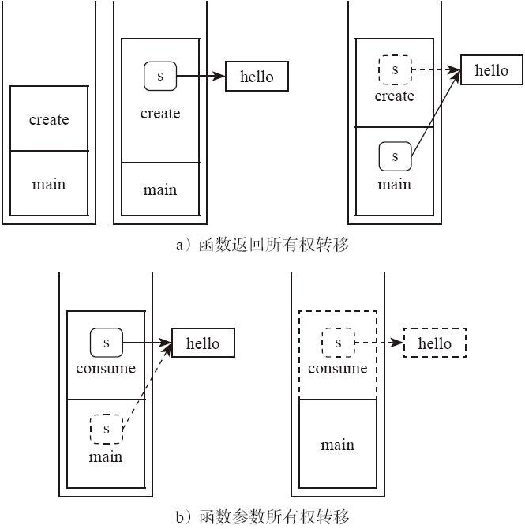

### 11.2 转移语义

一个变量可以把它拥有的值转移给另外一个变量，称为“所有权转移”。赋值语句、函数调用、函数返回等，都有可能导致所有权转移。

比如：

---

```rust
fn create() -> String {
    let s = String::from("hello");
    return s; // 所有权转移，从函数内部移动到外部
}

fn consume(s: String) { // 所有权转移，从函数外部移动到内部
    println!("{}", s);
}

fn main() {
    let s = create();
    consume(s);
}
```

---

在上面这个例子中，函数参数、函数返回都发生了所有权转移，转移的过程可以用图 11-1 表示。

所有权转移的步骤分解如下。

1）main 函数调用 create 函数。

2）在调用 create 函数的时候创建了字符串，在栈上和堆上都分配有内存。局部变量 s 是这些内存的所有者。

3）create 函数返回的时候，需要将局部变量 s 移动到函数外面，这个过程就是简单地按字节复制 memcpy。



图 11-1

4）同理，在调用 consume 函数的时候，需要将 main 函数中的局部变量转移到 consume 函数，这个过程也是简单地按字节复制 memcpy。

5）当 consume 函数结束的时候，它并没有把内部的局部变量再转移出来，这种情况下，consume 内部局部变量的生命周期就该结束了。这个局部变量 s 生命周期结束的时候，会自动释放它所拥有的内存，因此字符串也就被释放了。

Rust 中所有权转移的重要特点是，它是所有类型的默认 语义。这是许多读者一开始不习惯的地方。这里再重复一遍，请大家牢牢记住，Rust 中的变量绑定操作，默认是 move 语义，执行了新的变量绑定后，原来的变量就不能再被使用！一定要记住！

Rust 的这一规定非常有利于编译器静态检查。与之相对的，C++ 的做法就不一样了，它允许赋值构造函数、赋值运算符重载，因此在出现“构造”或者“赋值”操作的时候，有可能表达的是完全不同的含义，这取决于程序员如何实现重载。C++ 的这个设计具有巨大的灵活性，但是不恰当的实现也可能造成内存不安全。而 Rust 的这一设计大幅降低了语言的复杂度，“移动语义”不可能执行用户的自定义代码，没有任何内存安全风险，而且满足异常安全。在 C++ 里面，`std::vector<int>v1=v2;`是复制语义，而 Rust 里面的`let v1：Vec<i32>=v2;`是移动语义。如果要在 Rust 里面实现复制语义，需要显式写出函数调用`let v1：Vec<i32>=v2.clone();`。如果我们在 C++ 中实现移动语义，则需要用户自定义实现移动构造函数及移动赋值运算符。

对于“移动语义”，最后还需要强调的一点是，“语义”不代表最终的执行效率。“语义”只是规定了什么样的代码是编译器可以接受的，以及它执行后的效果可以用怎样的思维模型去理解。编译器有权在不改变语义的情况下做任何有利于执行效率的优化。语义和优化是两个阶段的事情。我们可以把移动语义想象成执行了一个 memcpy，但真实的汇编代码未必如此。比如：

---

```rust
fn create() -> BigObject {
    let local = …;
    return local;
}
let v = create();
```

---

完全可能被优化为类似如下的效果：

---

```rust
fn create(p: &mut BigObject) {
    ptr::write(p, …);
}
let mut v: BigObject = uninitialized();
create(&mut v);
```

---

编译器可以提前在当前调用栈中把大对象的空间分配好，然后把这个对象的指针传递给子函数，由子函数执行这个变量的初始化。这样就避免了大对象的复制工作，参数传递只是一个指针而已。这么做是完全满足移动语义要求的，而且编译器还有权利做更多类似的优化。
