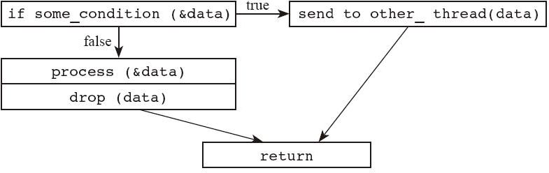

# 14.2 NLL 的原理

NLL 的设计目的是让“借用”的生命周期不要过长，适可而止，避免不必要的编译错误，把实际上正确的代码也一起拒绝掉。但是实现方法不能是简单地在 AST 上找一下某个引用最后一次在哪里使用，就让它的生命周期结束算了。我们用例子来说明：

---

```rust
fn baz() {
    let mut data = vec!['a', 'b', 'c'];
    let slice = &mut data[..]; // <-+ lifetime if we ignored
    loop {                     //   | variables altogether
        capitalize(slice);     //   |
        // <------------------------+
        data.push('d'); // Should be error, but would not be.
    }
    data.push('e');     // OK
    data.push('f');     // OK
}
```

---

在这个示例中，我们引入了一个循环结构。如果我们只是分析 AST 的结构的话，很可能会觉得 capitalize 函数结束后，slice 的生命周期就结束了，因此 data.push()方法调用是合理的。但这个结论是错误的，因为这里有一个循环结构。大家想想看，如果执行了 push()方法后，引发了 Vec 数据结构的扩容，它把以前的空间释放掉，申请了新的空间，进入下一轮循环的时候，slice 就会指向一个非法地址，会出现内存不安全。以上这段代码理应出现编译错误。

因此，新版本的借用检查器将不再基于 AST 的语句块来设计，而是将 AST 转换为另外一种中间表达形式 MIR（middle-level intermediate representation）之后，在 MIR 的基础上做分析。这是因为前面已经分析过了，对于复杂一点的程序逻辑，基于 AST 来做生命周期分析是费力不讨好的事情，而 MIR 则更适合做这种分析。读者可以用以下编译器命令打印出 MIR 的文本格式：

---

```rust
rustc --emit=mir test.rs
```

---

不过在一般情况下，MIR 在编译器内部的表现形式是内存中的一组数据结构。这些数据结构描述的是一个叫作“控制流图”（control flow graph）的概念。所谓控制流图，就是用“图”这种数据结构，描述程序的执行流程。每个函数都有一个 MIR 来描述它，比如对于以下这段代码：

---

```rust
fn send_if2(data: Vec<Data>) {
    if some_condition(&data) {
        send_to_other_thread(data);
        return;
    }

    process(&data);
}
```

---

生成的控制流图如图 14-1 所示。

图上面有节点，也有边。节点代表一条或者一组语句，边代表分支跳转。有了这个图，引用的生命周期就可以用这个图上的节点来表示了。编译器最后会分析出来，引用在这个图上的哪些节点上还是活着的，在哪些节点上可以看作已经死掉了。相比于以前，一个引用的生命周期直接充满整个语句块，现在的表达方式明显要精细得多，这样我们就可以保证引用的生命周期不会被过分拉长。



图 14-1

这个新版的借用分析器，会允许下面的代码编译成功，比如：

---

```rust
#![feature(nll)]
fn main() {
    let mut v = vec![1,2,3,4,5];
    v.push(v.len()); // 同一行，既有 & 型借用，也有 &mut 型借用。但逻辑上是安全的
    println!("{:?}", v);
}
```

---

目前版本中，如果去掉`#![feature(nll)]`就会出现编译错误。

再比如：

---

```rust
#![feature(nll)]
fn main() {
    let mut data = 100_i32;
    let mut p = &data; // p is live
    println!("{}", p); // p is dead

    data = 101;
    p = &data;         // p is live again
    println!("{}", p); // p is dead again
}
```

---

上面这个示例启用了新的生命周期分析器后，也可以编译成功。它不会再把 p 指针的生命周期当成从声明到语句块结束，而是聪明地查出了到第一次 println！就可以结束了，后面的 data 又重新赋值的时候不会跟它冲突。

另外需要强调的是：

* 这个功能只影响静态分析结果，不影响程序的执行情况；

* 以前能编译通过的程序以后依然会编译通过，不会影响以前的代码；

* 它依然保证了安全性，只是将以前过于保守的检查规则适当放宽；

* 它依赖的依然是静态检查规则，不会涉及任何动态检查规则；

* 它只影响“引用类型”的生命周期，不影响“对象”的生命周期，即维持现有的析构函数调用时机不变；

* 它不会影响 RAII 语义。

在编写本书之时，此功能还没有完全实现，但是鉴于该功能的重要性，笔者依然觉得非常有必要向各位读者提前介绍。希望该功能尽快完成，以减少不必要的编译错误对新手的困扰。
