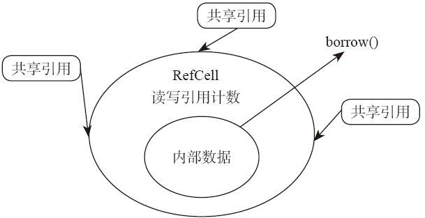

# 15.2 RefCell

RefCell 是另外一个提供了内部可变性的类型。它提供的方式与 Cell 类型有点不一样。Cell 类型没办法制造出直接指向内部数据的指针，而 RefCell 可以。我们来看一下它的 API：

---

```rust
impl<T: ?Sized> RefCell<T> {

    pub fn borrow(&self) -> Ref<T> {    }

    pub fn try_borrow(&self) -> Result<Ref<T>, BorrowError> {    }

    pub fn borrow_mut(&self) -> RefMut<T> {    }

    pub fn try_borrow_mut(&self) -> Result<RefMut<T>, BorrowMutError> {    }

    pub fn get_mut(&mut self) -> &mut T {    }
}
```

---

`get_mut`方法与`Cell::get_mut`一样，可以通过`&mut self`获得`&mut T`，这个过程是安全的。除此之外，RefCell 最主要的两个方法就是 borrow 和`borrow_mut`，另外两个`try_borrow`和`try_borrow_mut`只是它们俩的镜像版，区别仅在于错误处理的方式不同。

我们还是用示例来演示一下 RefCell 怎样使用：

---

```rust
use std::cell::RefCell;

fn main() {
    let shared_vec: RefCell<Vec<isize>> = RefCell::new(vec![1, 2, 3]);
    let shared1 = &shared_vec;
    let shared2 = &shared1;

    shared1.borrow_mut().push(4);
    println!("{:?}", shared_vec.borrow());

    shared2.borrow_mut().push(5);
    println!("{:?}", shared_vec.borrow());
}
```

---

在这个示例中，我们用一个 RefCell 包了一个 Vec，并且制造了另外两个共享引用指向同一个 RefCell。这时，我们可以通过任何一个共享引用调用`borrow_mut`方法，获得指向内部数据的“可写”指针，通过这个指针调用了 push 方法，修改内部数据。同时，我们也可以通过调用 borrow 方法获得指向内部数据的“只读”指针，读取 Vec 里面的值。

编译，执行，结果为：

---

```rust
$ ./test
[1, 2, 3, 4]
[1, 2, 3, 4, 5]
```

---

这里有一个小问题需要跟大家解释一下：在函数的签名中，`borrow`方法和`borrow_mut`方法返回的并不是`&T`和`&mut T`，而是`Ref<T>`和`RefMut<T>`。它们实际上是一种“智能指针”，完全可以当作`&T`和`&mut T`的等价物来使用。标准库之所以返回这样的类型，而不是原生指针类型，是因为它需要这个指针生命周期结束的时候做点事情，需要自定义类型包装一下，加上自定义析构函数。至于包装起来的类型为什么可以直接当成指针使用，它的原理可以参考下一章“解引用”。

那么问题来了：如果`borrow`和`borrow_mut`这两个方法可以制造出指向内部数据的只读、可读写指针，那么它是怎么保证安全性的呢？像前几章讲的那样，如果同时构造了只读引用和可读写引用指向同一个 Vec，那不是很容易就构造出悬空指针么？答案是，RefCell 类型放弃了编译阶段的 alias+mutation 原则，但依然会在执行阶段保证 alias+mutation 原则。示例如下：

---

```rust
use std::cell::RefCell;

fn main() {
    let shared_vec: RefCell<Vec<isize>> = RefCell::new(vec![1, 2, 3]);
    let shared1 = &shared_vec;
    let shared2 = &shared1;

    let p1 = shared1.borrow();
    let p2 = &p1[0];

    shared2.borrow_mut().push(4);
    println!("{}", p2);
}
```

---

上面这个示例的意图是：我们先调用`borrow`方法，并制造一个指向数组第一个元素的指针，接着再调用`borrow_mut`方法，修改这个数组。这样，就构造出了同时出现 alias 和 mutation 的场景。

编译，通过。执行，问题来了，程序出现了 panic：

---

```rust
$ ./test
thread 'main' panicked at 'already borrowed: BorrowMutError', src\libcore\result.rs:860:4
note: Run with `RUST_BACKTRACE=1` for a backtrace.
```

---

出现 panic 的原因是，RefCell 探测到同时出现了 alias 和 mutation 的情况，它为了防止更糟糕的内存不安全状态，直接使用了 panic 来拒绝程序继续执行。如果我们用`try_borrow`方法的话，就会发现返回值是`Result::Err`，这是另外一种更友好的错误处理风格。

那么 RefCell 是怎么探测出问题的呢？原因是，RefCell 内部有一个“借用计数器”，调用`borrow`方法的时候，计数器里面的“共享引用计数”值就加 1。当这个`borrow`结束的时候，会将这个值自动减 1（如图 15-2 所示）。同样，`borrow_mut`方法被调用的时候，它就记录一下当前存在“可变引用”。如果“共享引用”和“可变引用”同时出现了，就会报错。



图 15-2

从原理上来说，Rust 默认的“借用规则检查器”的逻辑非常像一个在编译阶段执行的“读写锁”（read-write-locker）。如果同时存在多个“读”的锁，是没问题的；如果同时存在“读”和“写”的锁，或者同时存在多个“写”的锁，就会发生错误。RefCell 类型并没有打破这个规则，只不过，它把这个检查逻辑从编译阶段移到了执行阶段。RefCell 让我们可以通过共享引用&修改内部数据，逃过编译器的静态检查。但是它依然在兢兢业业地尽可能保证“内存安全”。我们需要的借用指针必须通过它提供的 API `borrow()` `borrow_mut()`来获得，它实际上是在执行阶段，在内部维护了一套“读写锁”检查机制。一旦出现了多个“写”或者同时读写，就会在运行阶段报错，用这种办法来保证写数据时候的执行过程中的内部状态不会被观测到，任何时候，开始读或者开始写操作开始的时候，共享的变量都处于一个合法状态。因此在执行阶段，RefCell 是有少量开销的，它需要维护一个借用计数器来保证内存安全。

所以说，我们一定不要过于滥用 RefCell 这样的类型。如果确有必要使用，请一定规划好动态借用出来的指针存活时间，否则会在执行阶段有问题。

Cell 和 RefCell 用得最多的场景是和多个只读引用相配合。比如，多个&引用或者 Rc 引用指向同一个变量的时候。我们不能直接通过这些只读引用修改变量，因为既然存在 alias，就不能提供 mutation。为了让存在多个 alias 共享的变量也可以被修改，那我们就需要使用内部可变性。Rust 中提供了只读引用的类型有&、Rc、Arc 等指针，它们可以提供 alias。Rust 中提供了内部可变性的类型有`Cell`、`RefCell`、`Mutex`、`RwLock`以及`Atomic*`系列类型等。这两类类型经常需要配合使用。

如果你需要把一个类型 T 封装到内部可变性类型中去，要怎样选择 Cell 和 RefCell 呢？原则就是，如果你只需要整体性地存入、取出 T，那么就选 Cell。如果你需要有个可读写指针指向这个 T 修改它，那么就选 RefCell。
