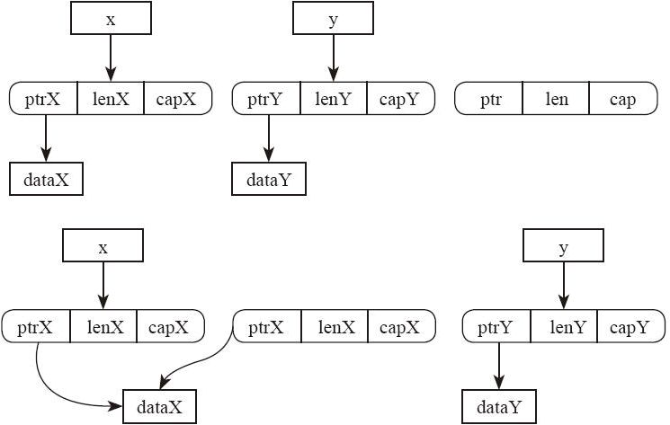
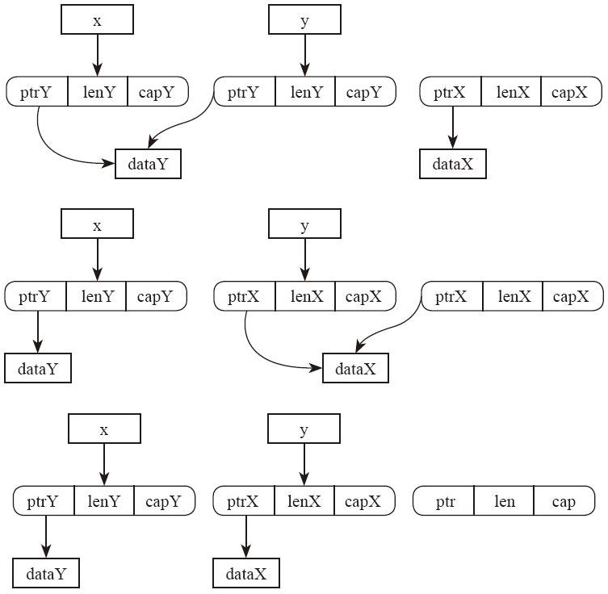

# 19.3 内置函数

在标准库中，有一个`std::intrinsics`模块，它里面包含了一系列的编译器内置函数。这些函数都有一个`extern "rust-intrinsic"`修饰，它们看起来都像一种特殊的 FFI 外部函数，大家打开标准库的源代码`src/core/intrinsics.rs`，可以看到这些函数根本没有函数体，因为它们的实现是在编译器内部，而不是在标准库内部。调用它们的时候都必须使用 unsafe 才可以。编译器见到这些函数，就知道应该生成什么样的代码，而不是像普通函数调用一样处理。另外，intrinsics 是藏在一个 feature gate 后面的，这个 feature 可能永远不会稳定，这些函数就不是准备直接提供给用户使用的。一般标准库会在这些函数基础上做一个更合适的封装给用户使用。

下面就在这些函数中挑一部分作介绍。

## 19.3.1 transmute

`fn transmute<T，U>（e：T）->U`函数可以执行强制类型转换。把一个 T 类型参数转换为 U 类型返回值，转换过程中，这个参数的内部二进制表示不变。但是有一个约束条件，即`size_of::<T>() == size_of::<U>()`。如果不符合这个条件，会发生编译错误。`transmute_copy`的作用跟它类似，区别是，参数类型是一个借用为`&T`。

一般情况下，我们也可以用 as 做类型转换，把`&T`类型指针转换为裸指针，然后再转换为`&U`类型的指针。这样也可以实现类似的功能。但是用户自己实现的泛型函数有一个缺陷，即无法在`where`条件中自己表达`size_of::<T>()==size_of::<U>()`。而`transmute`作为一个内置函数就可以实现这样的约束。

`transmute`和`transmute_copy`在`std::mem`模块中重新导出。用户如果需要，请使用这个模块，而不是`std::intrinsics`模块。

下面用一个示例演示一下 Vec 类型的二进制表示是怎样的：

---

```rust
fn main() {
    let x = vec![1,2,3,4,5];

    unsafe {
        let t : (usize, usize, usize) = std::mem::transmute_copy(&x);
        println!("{} {} {}", t.0, t.1, t.2);
    }
}
```

---

上面的例子中，我们调用了`transmute_copy`，因此参数类型是`&Vec`。假如我们用`transmute`函数，参数类型就必须是 Vec，区别在于，参数会被 move 进入这个函数中，在后面就不能继续使用了。在调用 transmute\_copy 函数的时候，必须显示指定返回值类型，因为它是泛型函数，返回值类型可以有多种多样的无穷变化，只要满足`size_of::<T>() == size_of::<U>()`条件，都可以完成类型转换。所以编译器自己是无法自动推理出返回值类型的。在上例中，我们的返回值类型是包含三个 usize 的 tuple 类型。这是因为，Vec 中实际包含了 3 个成员，一个是指向堆上的指针，一个是指向内存空间的总大小，还有一个是实际使用了的元素个数，因此这个类型转换从编译器看来是满足“占用内存空间相同”这一条件的。

编译执行，我们就可以看到 Vec 内部的具体内存表示了。执行结果为：

---

```rust
6393920 5 5
```

---

## 19.3.2 内存读写

intrinsics 模块里面有几个与内存读写相关的函数，比如`copy`、`copy_nonoverla-pping`、`write_bytes`、`move_val_init`、`volatile_load`等。这些函数又在`std::ptr`/`std::mem`模块中做了个简单封装，然后暴露出来给用户使用。下面挑其中几个重要的函数介绍。

1. `copy`

copy 的完整签名是`unsafe fn copy<T>(src: *const T, dst: *mut T, count: usize)`。它做的就是把 src 指向的内容复制到 dst 中去。它跟 C 语言里面的 memmove 类似，都假设 src 和 dst 指向的内容可能有重叠。区别是 memmove 的参数是`void*`类型，第三个参数是字节长度，而`ptr::copy`的指针是带类型的，第三个参数是对象的个数。

这个模块中还提供了`ptr::copy_nonoverlapping`。它跟 C 语言里面的 memcpy 很像，都假设用户已经保证了 src 和 dst 指向的内容不可重叠。所以 `tr::copy_nonoverlapping`的执行速度比`ptr::copy`要快一些。

2. `write`

在 ptr 模块中，write 的签名是`unsafe fn write<T>(dst: *mut T, src: T)`，作用是把变量 src 写入到 dst 所指向的内存中。注意它的参数 src 是使用的类型 T，执行的是 move 语义。查看源码可知，它是基于`intrinsics::move_val_init`实现的。注意，在写的过程中，不管 dst 指向的内容是什么，都会被直接覆盖掉。而 src 这个对象也不会执行析构函数。

写内存还有`ptr::write_bytes`、`ptr::write_unaligned`、`ptr::write_volatile`等函数。

3. `read`

在 ptr 模块中，read 的签名是`unsafe fn read<T>(src: *const T) -> T`，作用是把 src 指向的内容当成类型 T 返回去。查看它的内部源码，可见它就是基于`ptr::copy_nonoverlapping`实现的。

读内存还有`ptr::read_unaligned`以及`ptr::read_volatile`两个函数，大同小异。

以上这些内存读写函数，都是不管语义，直接操作内存中的字节。所以它们都是用 unsafe 函数。

4. `swap`

在 ptr 模块中，swap 的签名是`unsafe fn swap<T>（x: *mut T, y: *mut T)`，作用是把两个指针指向的内容做交换。两个指针所指向的对象都只是被修改，而不会被析构。

这个函数在 mem 模块中又做了一次封装，变成了`unsafe fn swap<T>(x: &mut T, y: &mut T)`供用户使用。签名中的&mut 型引用可以保证这两个指针是当前唯一指向该对象的指针。

某些特殊类型还有自己的 swap 成员函数。比如`Cell::swap(&self, other：&Cell<T>)`。这个函数跟其他 swap 函数最大的区别在于，它的参数只要求共享引用，不要求可变引用。这是因为 Cell 本身的特殊性。它具备内部可变性，所以这么设计是完全安全的。我们可以从源码看到，它就是简单地调用了`ptr::swap`。

5. `drop_in_place`

在 ptr 模块中，`drop_in_place`的签名是`unsafe fn drop_in_place<T: ?Sized>(to_drop: *mut T)`。它的作用是执行当前指向对象的析构函数，如果没有就不执行。

6. `uninitialized`

在 mem 模块中，uninitialized 的签名是`unsafe fn uninitialized<T>() -> T`。它是基于`intrinsics::uninit`函数实现的。我们知道，Rust 编译器要求每个变量必须在初始化之后再使用，如果在某些情况下，你确实需要未初始化的变量，那么必须使用 unsafe 才能做到。注意，任何时候读取未初始化变量都是未定义行为，请大家不要这么做。即便你在 unsafe 代码中创造了未初始化变量，也需要自己在逻辑上保证，读取这个变量之前先为它合理地赋过值。

另外，这个函数有点像`std::mem::forget`，调用这个函数，不仅不会在程序中增加代码，反而会减少可执行代码。调用 forget，会导致编译器不再插入析构函数调用的代码，调用 uninitialized 会导致缺少初始化。它们没有任何运行开销。

uninitialized 函数也还没有稳定，它有一些无法克服的缺陷，将来标准库会废弃掉这个函数，而使用一个新的类型让用户在 unsafe 代码中创建未初始化变量。

## 19.3.3 综合示例

下面我们用一个示例来演示一下这些 unsafe 函数的用途，以及怎样才能正确调用 unsafe 代码。示例很简单，就是实现标准库中的内存交换函数`std::mem::swap`。

我们可以确定这个函数的签名是`fn swap<T>(x: &mut T, y: &mut T)`。关于泛型的解释在第 21 章中有，此处略过不提。先试一个最简单的实现：

---

```rust
fn swap<T>(x: &mut T, y: &mut T) {
    let z : T = *x;
    *x = *y;
    *y = z;
}
```

---

编译不通过。因为`let z = *x;`执行的是 move 语义，编译器不允许我们把 x 指向的内容 move 出来，这只是一个借用而已。如果允许执行这样的操作，会导致原来的借用指针 x 指向非法数据。但是我们知道，我们这个函数整体上是可以保证安全的，因为我们把 x 指向的内容 move 出来之后，会用其他的正确数据填回去，最终可以保证函数执行完之后，x 和 y 都是一个正常的状态。这种时候，我们就需要动用 unsafe 了，代码如下：

---

```rust
fn swap<T>(x: &mut T, y: &mut T) {
    unsafe {
        let mut t: T = mem::uninitialized();

        ptr::copy_nonoverlapping(&*x, &mut t, 1);
        ptr::copy_nonoverlapping(&*y, x, 1);
        ptr::copy_nonoverlapping(&t, y, 1);

        mem::forget(t);
    }
}
```

---

代码逻辑的意思如下。

首先，我们依然需要一个作为中转的局部变量。这个局部变量该怎么初始化呢？其实我们不希望它执行初始化，因为我们只需要这部分内存空间而已，它里面的内容马上就会被覆盖掉，做初始化是浪费性能。况且，我们也不知道用什么通用的办法初始化一个泛型类型，它连 Default 约束都未必满足。所以我们要用`mem::uninitialized`函数。

接下来，我们可以直接通过内存复制来交换两个变量。因为在 Rust 中，所有的类型、所有的 move 操作，都是简单的内存复制，不涉及其他的语义。Rust 语言已经假定任何一个类型的实例，随时都可以被 move 到另外的地方，不会产生任何问题。所以，我们可以直接使用`ptr::copy`系列函数来完成。再加上在 safe 代码中，`&mut`型指针具有排他性，我们可以确信，x 和 y 一定指向不同的变量。所以可以使用`ptr::copy_nonoverlapping`函数，比`ptr::copy`要快一点。

最后，一定要记得，要阻止临时的局部变量 t 执行析构函数。因为 t 本身并未被合理地初始化，它内部的值是直接通过内存复制获得的。在复制完成后，它内部的指针（如果有的话）会和 y 指向的变量是相同的。如果我们不阻止它，那么在函数结束的时候它的析构函数就会被自动调用，这样 y 指向的变量就变成非法的了。

这样我们才能正确地完成这个功能。虽然源代码看起来比较长，但是实际生成的代码并不多，就是 3 次内存块的复制。假设执行的时候泛型参数 T 被实例化为`Vec<i32>`，这个`swap`函数的执行流程如图 19-1 所示。

在新版本的标准库的源码中，做法比这个更复杂，主要是为了更好地优化执行效率。它并没有在内存中分配一个临时对象，而是尽可能利用寄存器做数据交换。具体细节就不展开了，大家可以自己去读源码，自己尝试做性能测试。



图 19-1



图 19-1（续）
