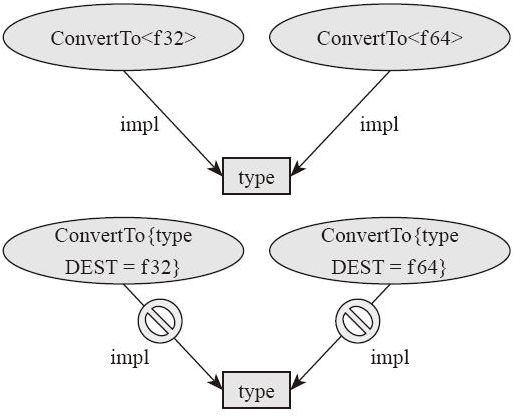

### 21.5 关联类型

trait 中不仅可以包含方法（包括静态方法）、常量，还可以包含“类型”。比如，我们常见的迭代器 Iterator 这个 trait，它里面就有一个类型叫 Item。其源码如下：

---

```rust
pub trait Iterator {
    type Item;
    ...
}
```

---

这样在 trait 中声明的类型叫作“关联类型”（associated type）。关联类型也同样是这个 trait 的“泛型参数”。只有指定了所有的泛型参数和关联类型，这个 trait 才能真正地具体化。示例如下（在泛型函数中，使用 Iterator 泛型作为泛型约束）：

---

```rust
use std::iter::Iterator;
use std::fmt::Debug;

fn use_iter<ITEM, ITER>(mut iter: ITER)
    where ITER: Iterator<Item=ITEM>,
            ITEM: Debug
{
    while let Some(i) = iter.next() {
        println!("{:?}", i);
    }
}

fn main() {
    let v: Vec<i32> = vec![1,2,3,4,5];
    use_iter(v.iter());
}
```

---

可以看到，我们希望参数是一个泛型迭代器，可以在约束条件中写 Iterator<Item=ITEM>。跟普通泛型参数比起来，关联类型参数必须使用名字赋值的方式。那么，关联类型跟普通泛型参数有哪些不同点呢？我们为什么需要关联参数呢？

1.可读性可扩展性

从上面这个例子中我们可以看到，虽然我们的函数只接受一个参数 iter，但是它却需要两个泛型参数：一个用于表示迭代器本身的类型，一个用于表示迭代器中包含的元素类型。这是相对冗余的写法。实际上，在有关联类型的情况下，我们可以将上面的代码简化，示例如下：

---

```rust
use std::iter::Iterator;
use std::fmt::Debug;
fn use_iter<ITER>(mut iter: ITER)
    where ITER: Iterator,
            ITER::Item: Debug
{
    while let Some(i) = iter.next() {
        println!("{:?}", i);
    }
}

fn main() {
    let v: Vec<i32> = vec![1,2,3,4,5];
    use_iter(v.iter());
}
```

---

这个版本的写法相对于上一个版本来说，泛型参数明显简化了，我们只需要一个泛型参数即可。在泛型约束条件中，可以写上 ITER 符合 Iterator 约束。此时，我们就已经知道 ITER 存在一个关联类型 Item，可以针对这个 ITER::Item 再加一个约束即可。如果我们的 Iterator 中的 Item 类型不是关联类型，而是普通泛型参数，就没办法进行这样的简化了。

我们再看另一个例子。假如我们想设计一个泛型的“图”类型，它包含“顶点”和“边”两个泛型参数，如果我们把它们作为普通的泛型参数设计，那么看起来就是：

---

```rust
trait Graph<N, E> {
    fn has_edge(&self, &N, &N) -> bool;
    ...
}
```

---

现在如果有一个泛型函数，要计算一个图中两个顶点的距离，它的签名会是：

---

```rust
fn distance<N, E, G: Graph<N, E>>(graph: &G, start: &N, end: &N) -> uint {
    ...
}
```

---

我们可以看到，泛型参数比较多，也比较麻烦。对于指定的 Graph 类型，它的顶点和边的类型应该是固定的。在函数签名中再写一遍其实没什么道理。如果我们把普通的泛型参数改为“关联类型”设计，那么数据结构就成了：

---

```rust
trait Graph {
    type N;
    type E;
    fn has_edge(&self, &N, &N) -> bool;
    ...
}
```

---

对应的，计算距离的函数签名可以简化成：

---

```rust
fn distance<G>(graph: &G, start: &G::N, end: &G::N) -> uint
    where G: Graph
{
    ...
}
```

---

由此可见，在某些情况下，关联类型比普通泛型参数更具可读性。

2.trait 的 impl 匹配规则

泛型的类型参数，既可以写在尖括号里面的参数列表中，也可以写在 trait 内部的关联类型中。这两种写法有什么区别呢？我们用一个示例来演示一下。

假如我们要设计一个 trait，名字叫作 ConvertTo，用于类型转换。那么，我们就有两种选择。一种是使用泛型类型参数：

---

```rust
trait ConvertTo<T> {
    fn convert(&self) -> T;
}
```

---

另一种是使用关联类型：

---

```rust
trait ConvertTo {
    type DEST;
    fn convert(&self) -> Self::DEST;
}
```

---

如果我们想写一个从 i32 类型到 f32 类型的转换，在这两种设计下，代码分别是：

---

```rust
impl ConvertTo<f32> for i32 {
    fn convert(&self) -> f32 { *self as f32 }
}
```

---

以及：

---

```rust
impl ConvertTo for i32 {
    type DEST = f32;
    fn convert(&self) -> f32 { *self as f32 }
}
```

---

到目前为止，这两种设计似乎没什么区别。但是，假如我们想继续增加一种从 i32 类型到 f64 类型的转换，使用泛型参数来实现的话，可以编译通过：

---

```rust
impl ConvertTo<f64> for i32 {
    fn convert(&self) -> f64 { *self as f64 }
}
```

---

如果用关联类型来实现的话，就不能通过编译了：

---

```rust
impl ConvertTo for i32 {
    type DEST = f64;
    fn convert(&self) -> f64 { *self as f64 }
}
```

---

错误信息为：

---

```rust
error: conflicting implementations of trait `ConvertTo` for type `i32`
```

---

由此可见，如果我们采用了“关联类型”的设计方案，就不能针对这个类型实现多个 impl。在编译器的眼里，如果 trait 有类型参数，那么给定不同的类型参数，它们就已经是不同的 trait，可以同时针对同一个类型实现 impl。如果 trait 没有类型参数，只有关联类型，给关联类型指定不同的类型参数是不能用它们针对同一个类型实现 impl 的。

 
