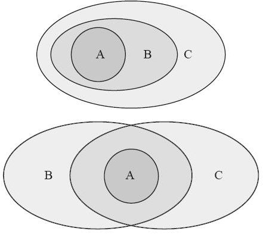

# 21.7 泛型特化

Rust 语言支持泛型特化，但还处于开发过程中，目前只能在最新的 nightly 版本中试用一些基本功能。

Rust 不支持函数和结构体的特化。它支持的是针对 impl 块的特化。我们可以为一组类型 impl 一个 trait，同时为其中一部分更特殊的类型 impl 同一个 trait。

示例如下：

```rust
#![feature(specialization)]

use std::fmt::Display;

trait Example {
    fn call(&self);
}

impl<T> Example for T
{
    default fn call(&self) {
        println!("most generic");
    }
}

impl<T> Example for T
    where T: Display
{
    default fn call(&self) {
        println!("generic for Display, {}", self);
    }
}

impl Example for str {
    fn call(&self) {
        println!("specialized for str, {}", self);
    }
}

fn main() {
    let v1 = vec![1i32,2,3];
    let v2 = 1_i32;
    let v3 = "hello";

    v1.call();
    v2.call();
    v3.call();
}
```

用 nightly 版本编译，执行，结果为：

```
most generic
generic for Display, 1
specialized for str, hello
```

> 将 impl 与尖括号 `<T>` 结合使用即可创建一个针对任意类型 T 的泛型实现。

这段代码中有三个 impl 块。第一个是针对所有类型实现 Example。第二个是针对所有的满足`T: Display`的类型实现 Example。第三个是针对具体的 str 类型实现 Example。一个比一个更具体，更特化。

对于主程序中`v1.call();`调用，因为`Vec<i32>`类型只能匹配第一个 impl 块，因此它调用的是最基本的版本。
对于主程序中的`v2.call();`调用，因为 i32 类型满足 Display 约束，所以它同时满足第一个或者第二个 impl 块的实现版本，而第二个 impl 块比第一个更具体、更匹配，所以编译器选择了调用第二个 impl 块的版本。
而对于`v3.call();`这句代码，实际上三个 impl 块都能和 str 类型相匹配，但是第三个 impl 块明显比其他两个 impl 块更特化，因此在主程序中调用的时候，选择了执行第三个 impl 块提供的版本。

在这个示例中，前面的 impl 块针对的类型范围更广，后面的 impl 块针对的类型更具体，它们针对的类型集合是包含关系，这就是特化。当编译器发现，针对某个类型，有多个 impl 能满足条件的时候，它会自动选择使用最特殊、最匹配的那个版本。

## 21.7.1 特化的意义

在 RFC 1210 中，作者列出了泛型特化的三个意义：

1. 性能优化。泛型特化可以为某些情况提供统一抽象下的特殊实现。
2. 代码重用。泛型特化可以提供一些默认（但不完整的）实现，某些情况下可以减少重复代码。
3. 为“高效继承”铺路。泛型特化其实跟 OOP 中的继承很像。

下面拿标准库中的代码举例说明。

标准库中存在一个 ToString trait，定义如下：

---

```rust
pub trait ToString {
    fn to_string(&self) -> String;
}
```

---

凡是实现了这个 trait 的类型，都可以调用`to_string`来得到一个 String 类型的结果。同时，标准库中还存在一个`std::fmt::Display` trait，也可以做到类似的事情。而且 Display 是可以通过`#[derive(Display)]`由编译器自动实现的。所以，我们可以想到，针对所有满足`T: Display`的类型，我们可以为它们提供一个统一的实现：

---

```rust
impl<T: fmt::Display + ?Sized> ToString for T {
    #[inline]
    fn to_string(&self) -> String {
        use core::fmt::Write;
        let mut buf = String::new();
        let _ = buf.write_fmt(format_args!("{}", self));
        buf.shrink_to_fit();
        buf
    }
}
```

---

这样一来，我们就没必要针对每一个具体类型来实现 ToString。这么做，非常有利于代码重用，所有满足`T: Display`的类型，都自动拥有了`to_string`方法，不必一个个地手动实现。这样做代码确实简洁了，但是，对于某些类型，比如&str 类型想调用`to_string`方法，效率就有点差强人意了。因为这段代码针对的是所有满足 Display 约束的类型来实现的，它调用的是 fmt 模块的功能，内部实现非常复杂而烦琐。如果我们用&str 类型调用`to_string`方法的话，还走这么复杂的一套逻辑，略显多余。这也是为什么在早期的 Rust 代码中，`&str`转为 String 类型比较推荐以下方式：

---

```rust
// 推荐
let x : String = "hello".into();
// 推荐
let x : String = String::from("hello");
// 不推荐，因为效率低
let x : String = "hello".to_string();
```

---

现在有了泛型特化，这个性能问题就可以得到修复了，方案如下：

---

```rust
impl<T: fmt::Display + ?Sized> ToString for T {
    #[inline]
    default fn to_string(&self) -> String {
        ...
    }
}

impl ToString for str {
    #[inline]
    fn to_string(&self) -> String {
        String::from(self)
    }
}
```

---

我们可以为那个更通用的版本加一个 default 标记，然后再为 str 类型专门写一个特殊的实现。这样，对外接口依然保持统一，但内部实现有所区别，尽可能地提高了效率，满足了“零开销抽象”的原则。

## 21.7.2 default 上下文关键字

我们可以看到，在使用泛型特化功能的时候，我们在许多方法前面加上了 default 关键字做修饰。这个 default 不是全局关键字，而是一个“上下文相关”关键字，它只在这种场景下是特殊的，在其他场景下，我们依然可以用它作为合法的变量/函数名字。比如标准库的 Default trait 中，就有一个方法名字叫作`default()`，这并不冲突。

为什么需要这样的一个关键字呢？这是因为，泛型特化其实很像传统 OOP 中的继承重写 override 功能。在传统的支持重写功能的语言中，一般都有一个类似的标记：

（1）C++ 中使用了 virtual 关键字来让一个方法可以在子类型中重写。Modern C++ 还支持 final 和 override 限定符。

（2）C# 要求使用virtual关键字定义虚函数，用override关键字标记重写方法。

（3）Java 默认让所有方法都是虚方法，但它也支持用 final 关键字让方法不可被重写。

之所以虚函数需要这样的标记，主要是因为重写方法在某种意义上是一种非局部交互。调用虚函数的时候，有可能调用的是在另外一个子类中被重写后的版本。在这种情况下，最好是用一种方式表示出来，这个方法是有可能在其他地方被重写的。

虽然模板特化跟虚函数重写不是一个东西，但它们很相似。所以，一个可以被特化的方法，最好也用一个明显的标签显式标记出来。这个设计也可以保证代码的前向兼容性。假如没有这样的语法规定，那么很可能出现的场景是：以前写的一个库明明执行起来没问题，现在有了泛型特化之后，跟其他库一起用到一个项目中，就有了问题。比如，在某个项目中，我们针对一组类型实现了某个 trait，而且存在一个变量调用了这个 trait 内部的方法。但是如果我们引入一个新的库，这个库针对某具体类型实现了同样的 trait，就意味着存在了一个更精确的、更特化的实现，于是原来项目中调用的方法就被悄无声息地改变了。如果我们规定 trait 的设计者本身有权规定自己的这个 trait（以及 trait 内部的每个方法）是否支持特化，就不会出现这个问题。原有 trait 内部的方法没有 default 修饰的话，对它进行特化只会导致编译错误。

如果没有 default 修饰的话，会产生的新问题。Rust 里 impl 块中的方法默认是不可被“重写”特化的。比如我们已经有一个这样的 impl 代码：

---

```rust
impl<T> Example for T {
    type Output = Box<T>;
    fn generate(self) -> Box<T> { Box::new(self) }
}
```

---

此时，下面这段调用应该是可以编译通过的：

---

```rust
fn test(t: bool) -> Box<bool> {
    Example::generate(t)
}
```

---

我们假设一个针对 bool 类型的特化版本：

---

```rust
impl Example for bool {
    type Output = bool;
    fn generate(self) -> bool { self }
}
```

---

这样就会导致原来的 test 方法编译失败，因为`generate`方法的返回类型变成了 bool，而不是`Box<bool>`。如果我们要求使用 default 关键字来标记是否可以被特化的话，这个问题就可以解决了：

---

```rust
impl<T> Example for T {
    default type Output = Box<T>;
    default fn generate(self) -> Box<T> { Box::new(self) }
}

// 编译器应该会认为下面的返回类型不匹配
fn test(t: bool) -> Box<bool> {
    Example::generate(t)
}
```

---

编译器可以制定一个这样的规则：如果关联类型前面有 default 修饰，那么调用`generate`方法的返回值不能直接当成`Box<T>`类型处理。这就可以解决代码兼容性问题。

## 21.7.3 交叉 impl

前面我们已经演示了什么是泛型特化。我们可以利用泛型针对一组类型写 impl，还可以继续针对这个集合中的某一个部分写更特殊的 impl。用集合的韦恩图表示如右图所示：



但是，如果我们写 impl 的时候针对的两个集合并非真子集关系，而是交集关系，怎么办？就像右图这样：

用代码表示：

---

```rust
trait Foo {}
trait B {}
trait C {}

// 第一个 impl
impl<T> Foo for T where T: B {}
// 第二个 impl
impl<T> Foo for T where T: C {}
```

---

此时就出现了交叉的情况。万一有一个类型满足`T: B+C`呢？在调用 Foo 中的方法的时候，究竟选 B 版本还是选 C 版本？B 和 C 之间不存在继承关系，它们不是真包含关系，所以判断不出究竟哪个更匹配、更特殊、更吻合。所以在这种情况下，编译器理应报错。

为了解决这个问题，Rust 设计者又提出了一个交集规则：如果两个 impl 之间存在交集，而且又不是真包含关系，那么可以为这个交集再写一个 impl，这样这个 impl 就是最特化的那个版本。即：

---

```rust
// 第三个 impl
impl<T> Foo for T where T: B+C {}
```

---

如果一个类型既满足 B 约束，又满足 C 约束，那么与它最匹配的 impl 版本就是新加入的第三个 impl。

交集规则看起来既简洁又直观，可惜它并没有完全解决问题，还有一个遗留问题——跨项目交互。

下面有一个比较复杂的例子，来源于 Niko 的博客。假设我们的项目中设计了一个 RichDisplay，它很像标准库中的 Display trait，但是提供了更多的新功能。我们会为所有已经实现了 Display 的类型来 impl 我们的 RichDisplay：

---

```rust
// crate 1
trait RichDisplay {}
// impl 1
impl<T> RichDisplay for T where T: Display {}
```

---

现在假设在另一个项目 widget 里面有个类型`Widget<T>`。它没有实现 Display，但是我们希望为它实现 RichDisplay。这没有什么问题，因为 RichDisplay 是我们自己设计的：

---

```rust
// crate 1
// impl 2
impl<T> RichDisplay for Widget<T> where T: RichDisplay {}
```

---

到这里我们碰到问题了：第一个 impl 和第二个 impl 存在“潜在的”交叉的可能性。第一个 impl 是为所有满足 Display 约束的类型实现 RichDisplay；第二个 impl 是为 Widget 类型实现 RichDisplay。这两个 impl 针对的类型集合是有交叉的，因此应该出现编译错误。

这里的问题在于，Widget 类型是在另外一个项目中定义的。虽然它现在没有 impl Display，但它存在这样的可能性。也就是说，widget 项目加入了以下的代码，也不应该是一个破坏性扩展：

---

```rust
// crate widget
// impl 3
impl<T> Display for Widget<T> {}
```

---

如果这段代码存在，那么前面的第一个 impl 和第二个 impl 就冲突了。所以现在就有一个困境：上游的 widget crate 可能在将来加入或者不加入这个 impl，所以目前第一个 impl 和第二个 impl 之间的关系，既不能被认为是完全无关，也不能认定为泛型特化。如果设计不当，上游项目中一个简单的 impl 块，有可能引起下游用户的 breaking change，这是不应该出现的。

所以，如果我们要为某些 trait 添加默认实现，而且还想继续保持代码的前向兼容性，这个问题就必须考虑。仅仅靠“真子集”规则是不够的。

目前，泛型特化的完整规则依然处于酝酿之中，它的功能短时间内也还不能稳定，请大家关注 RFC 项目中的相关提案，跟踪最新的讨论结果。
