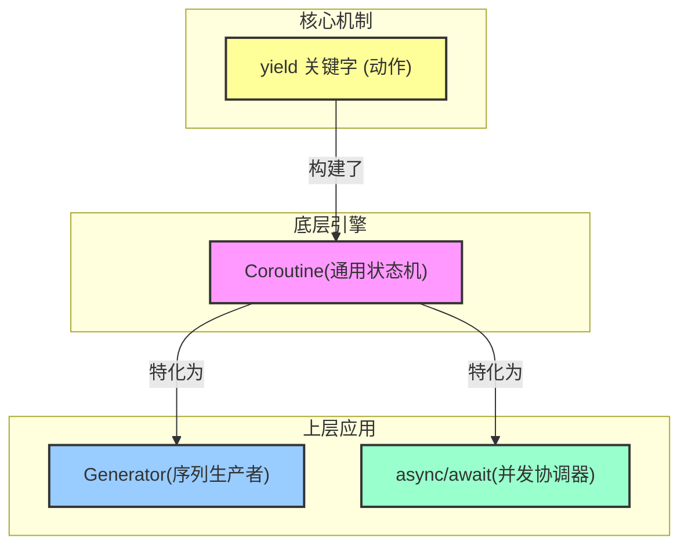

# 25.1 简介

协程很像前面讲过的闭包，但它与闭包有一个区别，即 `yield` 关键字。当闭包中有 `yield` 关键字的时候，它就不是一个闭包，而是一个协程。

## 25.1.1 `yield` 关键字

yield 是这一切的基石，你可以把它想象成函数里的一个**“可恢复的暂停按钮”** 或 “书签”。当代码执行到 yield 时，它会：

1. 交出（Yield）一个值：把 yield 后面的值作为结果返回给调用者。

2. 暂停（Pause）执行：将函数的当前状态（包括所有局部变量的值和执行位置）完整地保存下来，暂时挂起。

3. 交还（Yield）控制权：将程序的控制权返回给调用它的地方。

当调用者下一次“唤醒”（resume）这个协程时，它会精确地从上次 yield 暂停的地方继续执行，所有变量都保持着原来的状态。

## 协程 与 yield

协程是实现了 yield 机制的、最通用的底层结构。

- 它的定义：一个可以被暂停、恢复，并在暂停/恢复之间传递数据的计算单元。

- 它的本质：一个**双向通道**。

    1. 向外：通过 `yield` 将值产出给调用者。

    2. 向内：通过 `resume(argument)` 方法，在被唤醒时可以从调用者那里接收一个值。

**在 Rust 中，当编译器看到一个闭包里有 yield，它就会自动将其编译成一个实现了 Coroutine Trait 的状态机**。

在当前的 Rust 中，你主要通过一种特殊的闭包语法来创建协程：

```rust
#![feature(stmt_expr_attributes, coroutines, coroutine_trait)]
use std::ops::{Coroutine};
use std::pin::Pin;

// 这个闭包被编译成一个 Coroutine
let mut my_coroutine = #[coroutine] || {
    let from_caller = yield 1; // 1. 产出 1
                               // 2. 暂停，等待被 resume
                               // 3. 恢复时，resume 的参数会被赋给 from_caller
};
```

> 你可能对 `#[coroutine]` 好奇，如果你不加上，会报错：`error: `yield` can only be used in `#[coroutine]` closures, or `gen` blocks`，并提示你添加：`#[coroutine]`。

目前协程（coroutines）基础已经在 Nightly 里有原型（例如 `#[coroutine]`），[相关 tracking issue](https://github.com/rust-lang/rust/issues/43122) 上一直在跟进。

你可以将 Coroutine 视为一个通用的“引擎”。 它提供了暂停、恢复、双向通信的核心能力，但它本身不限定具体用途。它既可以用来生产数据，也可以用来协调任务。

## 25.1.2 生成器（Generator）

生成器是一个专门用于**惰性地、按需地生成一个值序列**的协程。它主要利用了协程的**向外**产出（yield）能力。它就像一个序列的生产者。**所有生成器都是协程，但并非所有协程都是生成器**。

在很多语言（如 Python）中，yield 关键字创建的直接就是“生成器”，因为这是最常见的用例。在很早以前（2018年前后），Rust Nightly 有过 `move || { yield ... }` 这样的 generator 语法，能跟 `std::ops::Generator` 一起用。

但是，Rust 团队对 Generator 有了新的定义。现在，Generator 只是一个生成 Iterator 的快捷方式，这意味着 Generator 是一种没有参数、没有返回值的 Coroutine。

为了更方便构造 Generator，在 Rust edition 2024 中引入了 **gen_blocks** 特性，一个简单的斐波那契数列为例：

```rust:{channel:"nightly",edition:"2024"}
#![feature(gen_blocks)]

fn fib() -> impl Iterator<Item = usize> {
    // gen block 返回一个 impl Iterator 的匿名类型。
    gen {
        let mut n1 = 1;
        let mut n2 = 1;
        let mut n3 = 2;
        yield n1;
        yield n2;
        loop {
            yield n3;
            n1 = n2;
            n2 = n3;
            n3 = n1 + n2;
        }
    }
}

fn main() {
    // 通过 take 截断前 10 个值。
    println!("{:?}", fib().take(10).collect::<Vec<usize>>());
}
```

若要运行上述代码，请使用 nightly 版本，在 `cargo.toml` 最上方添加 `cargo-features = ["edition2024"]`，并使用 `RUSTFLAGS="-Zunstable-options --edition 2024" cargo run` 运行。或者，你也可以[通过 godbolt 进行体验](https://godbolt.org/#g:!((g:!((g:!((h:codeEditor,i:(filename:'1',fontScale:12,fontUsePx:'0',j:1,lang:rust,selection:(endColumn:2,endLineNumber:21,positionColumn:2,positionLineNumber:21,selectionStartColumn:2,selectionStartLineNumber:21,startColumn:2,startLineNumber:21),source:'%23!!%5Bfeature(gen_blocks)%5D%0A%0Afn+fib()+-%3E+impl+Iterator%3CItem%3Dusize%3E+%7B%0A++++gen+%7B%0A++++++++let+mut+n1+%3D+1%3B%0A++++++++let+mut+n2+%3D+1%3B%0A++++++++let+mut+n3+%3D+2%3B%0A++++++++yield+n1%3B%0A++++++++yield+n2%3B%0A++++++++loop+%7B%0A++++++++++++yield+n3%3B%0A++++++++++++n1+%3D+n2%3B%0A++++++++++++n2+%3D+n3%3B%0A++++++++++++n3+%3D+n1+%2B+n2%3B%0A++++++++%7D%0A++++%7D%0A%7D%0A%0Apub+fn+main()+%7B%0A++++println!!(%22%7B:%3F%7D%22,+fib().take(10).collect::%3CVec%3Cusize%3E%3E())%3B%0A%7D'),l:'5',n:'0',o:'Rust+source+%231',t:'0')),k:48.5781990521327,l:'4',n:'0',o:'',s:0,t:'0'),(g:!((g:!((h:compiler,i:(compiler:nightly,deviceViewOpen:'1',filters:(b:'0',binary:'1',binaryObject:'1',commentOnly:'0',debugCalls:'1',demangle:'0',directives:'0',execute:'0',intel:'0',libraryCode:'1',trim:'1'),flagsViewOpen:'1',fontScale:14,fontUsePx:'0',j:1,lang:rust,libs:!(),options:'-Zunstable-options+--edition+2024',overrides:!(),selection:(endColumn:1,endLineNumber:1,positionColumn:1,positionLineNumber:1,selectionStartColumn:1,selectionStartLineNumber:1,startColumn:1,startLineNumber:1),source:1),l:'5',n:'0',o:'+rustc+nightly+(Editor+%231)',t:'0')),header:(),l:'4',m:50,n:'0',o:'',s:0,t:'0'),(g:!((h:output,i:(editorid:1,fontScale:14,fontUsePx:'0',j:1,wrap:'1'),l:'5',n:'0',o:'Output+of+rustc+nightly+(Compiler+%231)',t:'0')),k:50,l:'4',m:50,n:'0',o:'',s:0,t:'0')),k:51.421800947867304,l:'3',n:'0',o:'',t:'0')),l:'2',n:'0',o:'',t:'0')),version:4)。

按照 Rust 团队的设想，gen block 理应是 Coroutine 的语法糖，上述代码应当解糖为（暂时不能编译）：

```rust
fn fib() -> impl Iterator<Item = usize> {
    std::iter::from_fn(|| {
        let mut n1 = 1;
        let mut n2 = 1;
        let mut n3 = 2;
        yield Some(n1);
        yield Some(n2);
        loop {
            yield Some(n3);
            n1 = n2;
            n2 = n3;
            n3 = n1 + n2;
        }
    })
}
```

同样，由于 gen block 被定性为 Coroutine 的语法糖，因此在引用外部变量时的行为也类似闭包，需要使用 move 移入（[在 godbolt 上体验](https://godbolt.org/#g:!((g:!((g:!((h:codeEditor,i:(filename:'1',fontScale:12,fontUsePx:'0',j:1,lang:rust,selection:(endColumn:73,endLineNumber:3,positionColumn:73,positionLineNumber:3,selectionStartColumn:73,selectionStartLineNumber:3,startColumn:73,startLineNumber:3),source:'%23!!%5Bfeature(gen_blocks)%5D%0A%0Afn+gen_multiple(input:+%26%5Busize%5D,+multiple:+usize)+-%3E+impl+Iterator%3CItem+%3D+usize%3E+%2B+!'_+%7B%0A++++gen+move+%7B%0A++++++++for+i+in+input+%7B%0A++++++++++++yield+i+*+multiple%3B%0A++++++++%7D%0A++++%7D%0A%7D%0A%0Apub+fn+main()+%7B%0A++++let+input+%3D+(0..10).collect::%3CVec%3Cusize%3E%3E()%3B%0A++++println!!(%22%7B:%3F%7D%22,+gen_multiple(%26input,+2).collect::%3CVec%3Cusize%3E%3E())%3B%0A%7D'),l:'5',n:'0',o:'Rust+source+%231',t:'0')),k:48.5781990521327,l:'4',n:'0',o:'',s:0,t:'0'),(g:!((g:!((h:compiler,i:(compiler:nightly,deviceViewOpen:'1',filters:(b:'0',binary:'1',binaryObject:'1',commentOnly:'0',debugCalls:'1',demangle:'0',directives:'0',execute:'0',intel:'0',libraryCode:'1',trim:'1'),flagsViewOpen:'1',fontScale:14,fontUsePx:'0',j:1,lang:rust,libs:!(),options:'-Zunstable-options+--edition+2024',overrides:!(),selection:(endColumn:1,endLineNumber:1,positionColumn:1,positionLineNumber:1,selectionStartColumn:1,selectionStartLineNumber:1,startColumn:1,startLineNumber:1),source:1),l:'5',n:'0',o:'+rustc+nightly+(Editor+%231)',t:'0')),header:(),l:'4',m:50,n:'0',o:'',s:0,t:'0'),(g:!((h:output,i:(editorid:1,fontScale:14,fontUsePx:'0',j:1,wrap:'1'),l:'5',n:'0',o:'Output+of+rustc+nightly+(Compiler+%231)',t:'0')),k:50,l:'4',m:50,n:'0',o:'',s:0,t:'0')),k:51.421800947867304,l:'3',n:'0',o:'',t:'0')),l:'2',n:'0',o:'',t:'0')),version:4)）:
```rust
#![feature(gen_blocks)]

// gen block 引用 `input`，因此返回值类型添加生命周期 `'_` 进行约束
fn gen_multiple(input: &[usize], multiple: usize) -> impl Iterator<Item = usize> + '_ {
    // 将 `multiple` move 进 gen block，否则以 `&usize` 的形式访问 `multiple`
    gen move {
        for i in input {
            yield i * multiple;
        }
    }
}

fn main() {
    let input = (0..10).collect::<Vec<usize>>();
    println!("{:?}", gen_multiple(&input, 2).collect::<Vec<usize>>());
}
```

另一方面，按照设想，**gen block** 也可以和 **async block** 组合，成为 **Async Generator**。由于 rustc 暂时还无法支持该特性，我们直接看官方例子简单了解一下：

```rust
async gen {
  while let Some(item) = inner.next().await {
    yield func(item).await;
  }
}

// 按照设想，应该解糖为:
std::stream::from_fn(|ctx| {
  while let Some(item) = await_with!(inner.next(), ctx) {
    yield Ready(Some(await_with!(func(item), ctx)));
  }
  Ready(None)
})
```

> 这部分内容来自 [Rust: Generator 已死，Coroutine 当立，Generator 又活了](https://nihil.cc/posts/rust_coroutine/)

## 25.1.2 await 与 yield

你可能会想：“我用的是稳定版 Rust，从来没写过 yield，但这听起来很像 async/await 啊？”

因为 async/await 就是建立在协程和 yield 的机制之上的语法糖。

```rust
async fn do_stuff() {
    println!("准备下载...");
    let data = download_file().await; // 这里的 .await
    println!("下载完成: {:?}", data);
}
```

编译器在背后做的事情，概念上等同于：

1. 将 `do_stuff` 函数转换成一个协程（状态机）。

2. `download_file()` 返回一个 Future。

3 `.await` 的操作 ≈ **yield 并等待这个 Future 完成**。

  - **暂停（yield）**：`do_stuff` 协程暂停执行，把控制权交还给 Executor（如 Tokio）。

  - **等待**：Executor 会去轮询（poll）`download_file()` 的 Future。

  - **恢复**：当 `download_file()` 的 Future 完成后，Executor 会唤醒（resume）`do_stuff` 协程，并将 Future 的结果 data 传递回来，让协程从暂停点继续执行。

所以，虽然你可能永远不会直接在代码中写 `yield`，但你通过 async/await 每天都在使用它背后的强大能力。理解 `yield`，就是理解了 Rust 异步执行的灵魂。

**关系图**



## 25.1.3 生成 Fibonacci 数列

我们可以用协程生成一个 Fibonacci 数列：

```rust
// 方案一
#![feature(stmt_expr_attributes, coroutines, coroutine_trait)]

use std::ops::{Coroutine, CoroutineState};
use std::pin::Pin;

fn main() {
    // 新版 coroutine 写法
    let mut g = #[coroutine] || {
        let mut curr: u64 = 1;
        let mut next: u64 = 1;
        loop {
            let new_next = curr.checked_add(next);
            if let Some(new_next) = new_next {
                curr = next;
                next = new_next;
                yield curr; // 必须在 #[coroutine] 或 gen block 里用
            } else {
                return;
            }
        }
    };

    let mut pinned = Pin::new(&mut g); // 必须 Pin

    loop {
        // resume 现在的 arg 类型是 ()，得传单位参数
        match Coroutine::resume(pinned.as_mut(), ()) {
            CoroutineState::Yielded(v) => println!("{}", v),
            CoroutineState::Complete(_) => break,
        }
    }
}
```

协程最大的特点就是，程序的执行流程可以在协程和调用者之间来回切换。当我们需要暂时从协程中返回的时候，就使用 `yield` 关键字；当调用者希望再次进入协程的时候，就调用 `resume()` 方法，这时程序执行的流程是从上次 yield 返回的那个点继续执行。

上述程序的执行流程很有意思，它是这样的：

* `let g = #[coroutine] || {...yield...};`这句话是初始化了一个局部变量，它是一个协程，此时并不执行协程内部的代码；

* 调用`Coroutine::resume()`方法，此时会调用协程内部的代码；

* 执行到`yield curr;`这条语时，`curr` 变量的值为 `1`，协程的方法此时会退出，`Coroutine::resume()`方法的返回值是`CoroutineState::Yielded(1)`，在 `main` 函数中，程序会打印出 `1`；

* 循环调用 `Coroutine::resume()` 方法，此时再次进入到协程内部的代码中；

* 此时协程会直接从上次退出的那个地方继续执行，跳转到 `loop` 循环的开头，计算 `curr` `next` `new_next` 这几个变量新的值，然后再到 `yield curr;` 这条语句返回；

* 如此循环往复，一直到加法计算溢出，协程调用了`return;`语句，此时`main`函数那边会匹配上`CoroutineState::Complete`这个分支，程序返回，执行完毕。
