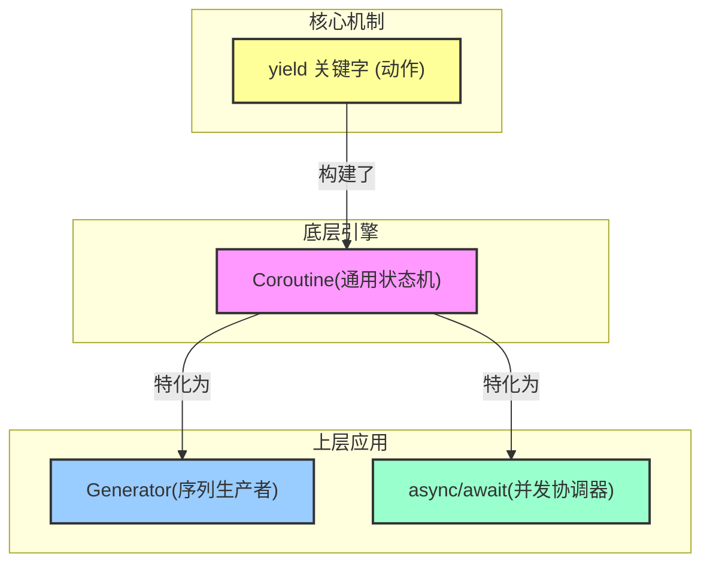

# 25.1 简介

协程很像前面讲过的闭包，但它与闭包有一个区别，即 `yield` 关键字。当闭包中有 `yield` 关键字的时候，它就不是一个闭包，而是一个协程。

## 25.1.1 `yield` 关键字

yield 是这一切的基石，你可以把它想象成函数里的一个**“可恢复的暂停按钮”** 或 “书签”。当代码执行到 yield 时，它会：

1. 交出（Yield）一个值：把 yield 后面的值作为结果返回给调用者。

2. 暂停（Pause）执行：将函数的当前状态（包括所有局部变量的值和执行位置）完整地保存下来，暂时挂起。

3. 交还（Yield）控制权：将程序的控制权返回给调用它的地方。

当调用者下一次“唤醒”（resume）这个协程时，它会精确地从上次 yield 暂停的地方继续执行，所有变量都保持着原来的状态。

## 协程 与 yield

协程是实现了 yield 机制的、最通用的底层结构。

- 它的定义：一个可以被暂停、恢复，并在暂停/恢复之间传递数据的计算单元。

- 它的本质：一个**双向通道**。

    1. 向外：通过 `yield` 将值产出给调用者。

    2. 向内：通过 `resume(argument)` 方法，在被唤醒时可以从调用者那里接收一个值。

**在 Rust 中，当编译器看到一个闭包里有 yield，它就会自动将其编译成一个实现了 Coroutine Trait 的状态机**。

在当前的 Rust 中，你主要通过一种特殊的闭包语法来创建协程：

```rust
#![feature(stmt_expr_attributes, coroutines, coroutine_trait)]
use std::ops::{Coroutine};
use std::pin::Pin;

// 这个闭包被编译成一个 Coroutine
let mut my_coroutine = #[coroutine] || {
    let from_caller = yield 1; // 1. 产出 1
                               // 2. 暂停，等待被 resume
                               // 3. 恢复时，resume 的参数会被赋给 from_caller
};
```

> 你可能对 `#[coroutine]` 好奇，如果你不加上，会报错：`error: `yield` can only be used in `#[coroutine]` closures, or `gen` blocks`，并提示你添加：`#[coroutine]`。

目前协程（coroutines）基础已经在 Nightly 里有原型（例如 `#[coroutine]`），但块级的 `gen { ... }` 语法因为语法解析（parser）和未来 async 集成问题，被搁置了，[相关 tracking issue](https://github.com/rust-lang/rust/issues/43122) 上一直在跟进，语法设计还没完全定型。
所以目前想玩协程，就只能用 `#[coroutine]` 注解的闭包写法，还没有 gen block 语法糖。

你可以将 Coroutine 视为一个通用的“引擎”。 它提供了暂停、恢复、双向通信的核心能力，但它本身不限定具体用途。它既可以用来生产数据，也可以用来协调任务。

## 25.1.2 生成器（Generator）

生成器是一个专门用于**惰性地、按需地生成一个值序列**的协程。它主要利用了协程的**向外**产出（yield）能力。它就像一个序列的生产者。**所有生成器都是协程，但并非所有协程都是生成器**。 生成器是协程的一个子集，它专注于“生成”这个单一任务。

在很多语言（如 Python）中，yield 关键字创建的直接就是“生成器”，因为这是最常见的用例。在很早以前（2018年前后），Rust Nightly 有过 `move || { yield ... }` 这样的 generator 语法，能跟 `std::ops::Generator` 一起用。
现在这套 generator 语法已经被更通用的 coroutine（协程）体系取代，API 名字、语法也不断调整。

Rust 现在主推的是协程（coroutine）的底层能力，generator 可能在将来是依赖协程补出来的语法糖——目前还不能像 Python 那样直接写一个生成器函数。

## 25.1.2 await 与 yield

你可能会想：“我用的是稳定版 Rust，从来没写过 yield，但这听起来很像 async/await 啊？”

因为 async/await 就是建立在协程和 yield 的机制之上的语法糖。

```rust
async fn do_stuff() {
    println!("准备下载...");
    let data = download_file().await; // 这里的 .await
    println!("下载完成: {:?}", data);
}
```

编译器在背后做的事情，概念上等同于：

1. 将 `do_stuff` 函数转换成一个协程（状态机）。

2. `download_file()` 返回一个 Future。

3 `.await` 的操作 ≈ **yield 并等待这个 Future 完成**。

  - **暂停（yield）**：`do_stuff` 协程暂停执行，把控制权交还给 Executor（如 Tokio）。

  - **等待**：Executor 会去轮询（poll）`download_file()` 的 Future。

  - **恢复**：当 `download_file()` 的 Future 完成后，Executor 会唤醒（resume）`do_stuff` 协程，并将 Future 的结果 data 传递回来，让协程从暂停点继续执行。

所以，虽然你可能永远不会直接在代码中写 `yield`，但你通过 async/await 每天都在使用它背后的强大能力。理解 `yield`，就是理解了 Rust 异步执行的灵魂。

**关系图**



## 25.1.3 生成 Fibonacci 数列

我们可以用协程生成一个 Fibonacci 数列：

```rust
// 方案一
#![feature(stmt_expr_attributes, coroutines, coroutine_trait)]

use std::ops::{Coroutine, CoroutineState};
use std::pin::Pin;

fn main() {
    // 新版 coroutine 写法
    let mut g = #[coroutine] || {
        let mut curr: u64 = 1;
        let mut next: u64 = 1;
        loop {
            let new_next = curr.checked_add(next);
            if let Some(new_next) = new_next {
                curr = next;
                next = new_next;
                yield curr; // 必须在 #[coroutine] 或 gen block 里用
            } else {
                return;
            }
        }
    };

    let mut pinned = Pin::new(&mut g); // 必须 Pin

    loop {
        // resume 现在的 arg 类型是 ()，得传单位参数
        match Coroutine::resume(pinned.as_mut(), ()) {
            CoroutineState::Yielded(v) => println!("{}", v),
            CoroutineState::Complete(_) => break,
        }
    }
}
```

协程最大的特点就是，程序的执行流程可以在协程和调用者之间来回切换。当我们需要暂时从协程中返回的时候，就使用 `yield` 关键字；当调用者希望再次进入协程的时候，就调用 `resume()` 方法，这时程序执行的流程是从上次 yield 返回的那个点继续执行。

上述程序的执行流程很有意思，它是这样的：

* `let g = #[coroutine] || {...yield...};`这句话是初始化了一个局部变量，它是一个协程，此时并不执行协程内部的代码；

* 调用`Coroutine::resume()`方法，此时会调用协程内部的代码；

* 执行到`yield curr;`这条语时，`curr` 变量的值为 `1`，协程的方法此时会退出，`Coroutine::resume()`方法的返回值是`CoroutineState::Yielded(1)`，在 `main` 函数中，程序会打印出 `1`；

* 循环调用 `Coroutine::resume()` 方法，此时再次进入到协程内部的代码中；

* 此时协程会直接从上次退出的那个地方继续执行，跳转到 `loop` 循环的开头，计算 `curr` `next` `new_next` 这几个变量新的值，然后再到 `yield curr;` 这条语句返回；

* 如此循环往复，一直到加法计算溢出，协程调用了`return;`语句，此时`main`函数那边会匹配上`CoroutineState::Complete`这个分支，程序返回，执行完毕。
