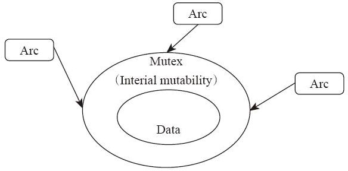

# 29.2 Mutex

与前面讲解的 Rc 类似，根据 Rust 的“共享不可变，可变不共享”原则，Arc 既然提供了共享引用，就一定不能提供可变性。
所以，Arc 也是只读的，它对外 API 和 Rc 是一致的。如果我们要修改怎么办？同样需要“内部可变性”。
当然，在多线程环境下，Cell 和 RefCell 已经不能用了，它们的内部实现根本没考虑过多线程的问题，所以它们不满足 Sync。
但是没关系，反正即使不小心误用了，也是编译错误。这种时候，我们需要用线程安全版本的“内部可变性”，如 Mutex 和 RwLock。

下面我们用一个示例来演示一下 Arc 和 Mutex 配合。使用多线程修改共享变量：

---

```rust
use std::sync::Arc;
use std::sync::Mutex;
use std::thread;

const COUNT: u32 = 1000000;

fn main() {
    let global = Arc::new(Mutex::new(0));

    let clone1 = global.clone();
    let thread1 = thread::spawn(move|| {
        for _ in 0..COUNT {
            let mut value = clone1.lock().unwrap();
            *value += 1;
        }
    });

    let clone2 = global.clone();
    let thread2 = thread::spawn(move|| {
        for _ in 0..COUNT {
            let mut value = clone2.lock().unwrap();
            *value -= 1;
        }
    });

    thread1.join().ok();
    thread2.join().ok();
    println!("final value: {:?}", global);
}
```

---

因为我们的闭包用了 move 关键字修饰，为了避免把 global 这个引用计数指针 move 进入闭包，所以在外面先提前复制一份，然后将复制出来的这个指针传入闭包中。这样两个线程就都拥有了指向同一个变量的 Arc 指针。

在这个程序中，我们使用两个线程修改同一个整数：一个线程对它进行多次加 1，另一个线程对它进行多次减 1。这次，我们使用 Arc 来实现多线程之间的共享，使用 Mutex 来提供内部可变性。每次需要修改的时候，我们需要调用`lock()`方法（或者`try_lock`）获得锁，然后才能对内部的数据进行读/写操作。因为锁的存在，我们就可以保证整个“读/写”是一个完整的 transaction。对于 Mutex 类型，标准库中有：

---

```rust
unsafe impl<T: ?Sized + Send> Send for Mutex<T> { }
unsafe impl<T: ?Sized + Send> Sync for Mutex<T> { }
```

---

因此，`Arc<Mutex<isize>>`可以满足 Send 要求。

`Mutex::lock()`方法的返回类型是`LockResult<MutexGuard<T>>`：

---

```rust
pub fn lock(&self) -> LockResult<MutexGuard<T>>
```

---

其中`LockResult`就是 Result 类型的一个别名，是用于错误处理的：

---

```rust
type LockResult<Guard> = Result<Guard, PoisonError<Guard>>;
```

---

如果当前 Mutex 已经是“有毒”（Poison）的状态，它返回的就是错误。什么情况会导致 Mutex 有毒呢？当 Mutex 在锁住的同时发生了 panic，就会将这个 Mutex 置为“有毒”的状态，以后再调用`lock()`都会失败。这个设计是为了 panic safety 而考虑的，主要就是考虑到在锁住的时候发生 panic 可能导致 Mutex 内部数据发生混乱。所以这个设计防止再次进入 Mutex 内部的时候访问了被破坏掉的数据内容。如果有需要的话，用户依然可以手动调用`PoisonError::into_inner()`方法获得内部数据。

而 MutexGuard 类型则是一个“智能指针”类型，它实现了 DerefMut 和 Deref 这两个 trait，所以它可以被当作指向内部数据的普通指针使用。MutexGuard 实现了一个析构函数，通过 RAII 手法，在析构函数中调用了`unlock()`方法解锁。因此，用户是不需要手动调用方法解锁的。



Rust 的这个设计，优点不在于它“允许你做什么”，而在于它“不允许你做什么”。 如果我们误用了`Rc<isize>`来实现线程之间的共享，就是编译错误。根据编译错误，我们将指针改为 Arc 类型，然后又会发现，它根本没有提供可变性。它的 API 只能共享读，根本没有写数据的方法存在。此时，我们会想到加入内部可变性来允许多线程共享读写。如果我们使用了`Arc<RefCell<_>>`类型，依然是编译错误。因为 RefCell 类型不满足 Sync。而`Arc<T>`需要内部的 T 参数必须满足`T：Sync`，才能使 Arc 满足 Sync。把这些综合起来，我们可以推理出`Arc<RefCell<_>>`是`!Sync`。

最终，编译器把其他的路都堵死了，唯一可以编译通过的就是使用那些满足 Sync 条件的类型，比如`Arc<Mutex<_>>`。在使用的时候，我们也不可能忘记调用 lock 方法，因为 Mutex 把真实数据包裹起来了，只有调用`lock`方法才有机会访问内部数据。我们也不需要记得调用`unlock`方法，因为 lock 方法返回的是一个 MutexGuard 类型，这个类型在析构的时候会自动调用`unlock`。

所以，编译器在逼着用户用正确的方式写代码。
