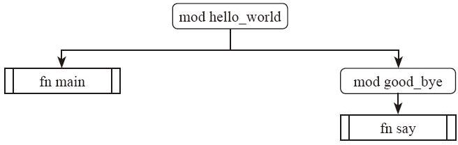

# 32.3 模块管理

前面我们讲解了如何使用 cargo 工具管理 crate。接下来还要讲解一个 crate 内部如何管理模块。可惜的是，Rust 设计组觉得目前的模块系统还有一些瑕疵，准备继续改进，在编写本书的时候这部分内容正处在热火朝天的讨论过程中。改进的目标是思维模型更简洁、更加具备一致性、方便各个层次的用户。所以本书在这部分不会强调太多的细节，因为目前一些看起来比较繁复的细节将来很可能会得到简化。

## 32.3.1 文件组织

mod（模块）是用于在 crate 内部继续进行分层和封装的机制。模块内部又可以包含模块。Rust 中的模块是一个典型的树形结构。
每个 crate 会自动产生一个跟当前 crate 同名的模块，作为这个树形结构的根节点。

比如在前面 32.1 cargo 章节中使用 cargo 创建多个项目的示例中，项目`hello_world`依赖于项目`good_bye`，我们要调用`good_bye`中的函数，需要写`good_bye::say();`，这是因为`say`方法存在于`good_bye`这个 mod 中。它们组成的树形关系如下图所示：



Cargo 遵循一个约定：`src/main.rs` 是与包同名的二进制 crate 的 crate root。如果包目录包含 `src/lib.rs`，则该包包含一个与包同名的库 crate，而 `src/lib.rs` 就是它的 crate root。

在编译 crate 时，编译器首先在 crate 根目录文件（库 crate 是 `src/lib.rs`，二进制 crate 是 `src/main.rs`）中查找要编译的代码。

因为这两个文件中的内容会形成了一个名为 `crate` 的模块，位于 crate 模块结构的根部，也就是模块树：

```
crate
 └── hello_world
     ├── good_bye
     │   └── say
     └── ...
         ├── ...
```


在一个 crate 内部创建新模块的方式有下面几种。

* 一个文件中创建内嵌模块。直接使用 `mod` 关键字即可，模块内容包含到大括号内部。

```rust
mod name {
  fn items() {}
  …
}
```

* 独立的一个文件就是一个模块。文件名即是模块名。

* 一个文件夹也可以创建一个模块。**文件夹内部要有一个`mod.rs`文件，这个文件就是这个模块的入口**。

示例：
```rust
mod garden;
...
```

所以查找 `garden` 子模块有几种可能：
- 内联情况：直接跟在 `mod garden` 后面，去除`;`，代码放在大括号内。

- 在文件 `src/garden.rs` 中

- 在文件 `src/garden/mod.rs` 中，这属于遗留的旧风格，不推荐使用，因为会导致项目可能存在多个 `mod.rs` 文件，当编辑器打开多个该名称的文件时，你就知道痛苦了。

最后一定不要同时使用两种风格！这会让人感到困惑。


使用哪种方式编写模块取决于当时的场景。
如果我们需要创建一个小型子模块，比如单元测试模块，那么直接写到一个文件内部就非常简单而且直观；
如果一个模块内容相对有点多，那么把它单独写到一个文件内是更容易维护的；
如果一个模块的内容太多了，那么把它放到一个文件夹中就更合理，因为我们可以把真正的内容继续分散到更小的子模块中，而在`mod.rs`中直接重新导出（re-export）。这样`mod.rs`的源码就大幅简化，不影响外部的调用者。

可以这样理解：模块是一种更抽象的概念，文件是承载这个概念的实体。但是模块和文件并不是简单的一一对应关系，用户可以自己维护这个映射关系。

比如，我们有一个库 crate 内部包含了两个模块，一个是 `caller` 一个是 `worker`。我们可以有几种方案来实现。

方案一：直接把所有代码都写到`lib.rs`里面：

```rust
// <lib.rs>
mod caller {
    fn call() {}
}

mod worker {
    fn work1() {}
    fn work2() {}
    fn work3() {}
}
```

方案二：把这两个模块分到两个不同的文件中，分别叫作`caller.rs`和`worker.rs`。

那么我们的项目就有了三个文件，它们的内容分别是：

```rust
// <lib.rs>
mod caller;
mod worker;

// <caller.rs>
fn call() {}

// <worker.rs>
fn work1() {}
fn work2() {}
fn work3() {}
```

因为`lib.rs`是这个 crate 的入口，我们需要在这里声明它的所有子模块，否则`caller.rs`和`worker.rs`都不会被当成这个项目的源码编译。

方案三：如果`worker.rs`这个文件包含的内容太多，我们还可以继续分成几个文件：

```rust
// <lib.rs>
mod caller;
mod worker;

// <caller.rs>
fn call() {}

// <worker/mod.rs>
mod worker1;
mod worker2;
mod worker3;

// <worker/worker1.rs>
fn work1() {}

// <worker/worker2.rs>
fn work2() {}

// <worker/worker3.rs>
fn work3() {}
```

这样就把一个模块继续分成了几个小模块。而且 `worker` 模块的拆分其实是不影响 `caller` 模块的，只要我们在 `worker` 模块中把它子模块内部的东西重新导出（re-export）就可以了。这个是可见性控制的内容，下面我们继续介绍可见性控制。

## 32.3.2 可见性

我们可以给模块内部的元素指定可见性。因为默认都是私有，除了两种例外情况：
- 用 `pub` 修饰的 trait 内部的关联元素（associated item），默认是公开的；
- `pub enum` 内部的成员默认是公开的。

公开和私有的访问权限是这样规定的：

- 如果一个元素是私有的，那么只有本模块内的元素以及它的子模块可以访问；
- 如果一个元素是公开的，那么上一层的模块就有权访问它。

示例如下：

```rust
mod top_mod1 {
    pub fn method1() {}

    pub mod inner_mod1 {
        pub fn method2() {}

        fn method3() {}
    }

    mod inner_mod2 {
        fn method4() {}

        mod inner_mod3 {
            fn call_fn_inside() {
                super::method4();
            }
        }
    }
}

fn call_fn_outside() {
    ::top_mod1::method1();
    ::top_mod1::inner_mod1::method2();
}
```

在这个示例中，`top_mod1`外部的函数`call_fn_outside()`，有权访问`method1()`，因为它是用 `pub` 修饰的。同样也可以访问`method2()`，因为`inner_mod1`是 pub 的，而且`method2`也是 pub 的。而`inner_mod2`不是 pub 的，所以外部的函数是没法访问`method4`的。但是`call_fn_inside`是有权访问`method4`的，因为它在`method4`所处模块的子模块中。

模块内的元素可以使用 `pub use` 重新导出（re-export）。这也是 Rust 模块系统的一个重要特点。
示例如下：

```rust
mod top_mod1 {
    pub use self::inner_mod1::method1;

    mod inner_mod1 {
        pub use self::inner_mod2::method1;

        mod inner_mod2 {
            pub fn method1() {}
        }
    }


}

fn call_fn_outside() {
    ::top_mod1::method1();
}
```

在`call_fn_outside`函数中，我们调用了`top_mod1`中的函数`method1`。可是我们注意到，`method1`其实不是在`top_mod1`内部实现的，它只是把它内部`inner_mod1`里面的函数重新导出了而已。
`pub use`就是起这样的作用，可以把元素当成模块的直接成员公开出去。我们继续往下看还可以发现，这个函数在`inner_mod1`里面也只是重新导出的，它的真正实现是在`inner_mod2`里面。

这个机制可以让我们轻松做到接口和实现的分离。我们可以先设计好一个模块的对外 API，这个固定下来之后，它的具体实现是可以随便改，不影响外部用户的。我们可以把具体实现写到任何一个子模块中，然后在当前模块重新导出即可。对外部用户来说，这没什么区别。

不过这个机制有个麻烦之处就是，如果具体实现嵌套在很深层次的子模块中的话，要把它导出到最外面来，必须一层层地转发，任何一层没有重新导出，都是无法达到目标的。

Rust 里面用 `pub` 标记了的元素最终可能在哪一层可见，并不能很简单地得出结论。因为它有可能被外面重新导出。为了更清晰地限制可见性，Rust 设计组又给 pub 关键字增加了下面的用法，可以明确地限定元素的可见性：

```rust
pub(crate)
pub(in xxx_mod)
pub(self)  // 或者 pub(in self)
pub(super) // 或者 pub(in super)
```

示例如下：

```rust
mod top_mod {
    pub mod inner_mod1 {
        pub mod inner_mod2 {
            pub(self) fn method1() {}
            pub(super) fn method2() {}
            pub(crate) fn method3() {}
        }

        // Error:
        // pub use self::inner_mod2::method1;
        fn caller1() {
            // Error:
            // self::inner_mod2::method1();
        }
    }

    fn caller2() {
        // Error:
        // self::inner_mod1::inner_mod2::method2();
    }
}

// Error:
// pub use ::top_mod::inner_mod1::inner_mod2::method3;
```

在`inner_mod2`模块中定义了几个函数。
`method1`用了`pub(self)`限制，那么它最多只能被这个模块以及子模块使用，在模块外部调用或者重新导出都会出错。
`method2`用了`pub(super)`限制，那么它的可见性最多就只能到`inner_mod1`这一层，在这层外面不能被调用或者重新导出。
而`method3`用了`pub(crate)`限制，那么它的可见性最多就只能到当前 crate 这一层，再继续往外重新导出，就会出错。

## 32.3.3 `use` 关键字

前面我们用了很多完整路径来访问元素。比如：

```rust
crate::top_mod1::inner_mod1::method2();
```

Rust 里面的路径有不同写法，它们代表的含义如下：

* 以 `crate` 关键字开头的路径是绝对路径。它是从当前 crate 的根开始的完整路径：

```rust
mod top_mod1 {
    pub fn f1() {}
}

mod top_mod2 {
    pub fn call() {
        crate::top_mod1::f1(); // 当前 crate 下的 top_mod1
    }
}
```

* 以 `super` 关键字开头的路径是相对路径。它是从上层模块开始算的：

```rust
mod top_mod1 {
    pub fn f1() {}

    mod inner_mod1 {
        pub fn call() {
            super::f1(); // 当前模块 inner_mod1 的父级模块中的 f1 函数
        }
    }
}
```

* 以`self`关键字开头的路径是相对路径。它是从当前模块开始算的：

```rust
mod top_mod1 {
    pub fn f1() {}

    pub fn call() {
        self::f1();  // 当前模块 top_mod1 中的 f1 函数
    }
}
```

通常我们倾向于使用绝对路径的方式，这样移动代码定义和调用代码都最好是独立互不影响的。

如果我们需要经常重复性地写很长的路径，那么可以使用`use`语句把相应的元素引入到当前的作用域中来。

* `use`语句可以用大括号，一句话引入多个元素：

```rust
use std::io::{self, Read, Write}; // 这句话引入了 io / Read / Write 三个名字
```

* `use`语句的大括号可以嵌套使用：

```rust
use a::b::{c, d, e::{f, g::{h, i}} };
```

* `use`语句可以使用星号，引入所有的元素：

```rust
use std::io::prelude::*;  // 这句话引入了 std::io::prelude 下面所有的名字
```

* `use`语句不仅可以用在模块中，还可以用在函数、trait、impl 等地方：

```rust
fn call() {
    use std::collections::HashSet;

    let s = HashSet::<i32>::new();
}
```

* `use`语句允许使用`as`重命名，避免名字冲突：

```rust
use std::result::Result as StdResult;
use std::io::Result as IoResult;
```

## 包名问题

在 rust 中 Cargo 包名（crate name）是允许使用连字符 `-`的，而 Rust 标识符（identifier）不允许使用连字符，只能使用下划线 `_`。所以在代码中引用包名时，如：

```rust
use my-lib::funx;
```

需要改为：
```rust
use my_lib::funx;
```

Rust 会自动将包名中的连字符转换为下划线。


如果你想在代码中使用不同的名称，可以在 Cargo.toml 中重命名依赖：

```toml
[dependencies]
my_lib = { path = "my-alib", package = "my-alib" }
```

然后在代码中使用：
```rust
use my_lib::funx;
```

这样就可以正常编译了。
