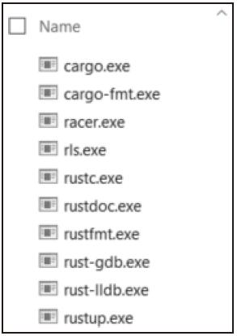

### 1.2 安装开发环境

Rust 编译器的下载和安装方法在官网上有文档说明，点击官网上的 Install 链接可以查看。Rust 官方已经提供了预编译好的编译器供我们下载，支持 Windows 平台、Linux 平台以及 Mac 平台。但是一般我们不单独下载Rust的编译器，而是使用一个叫 rustup 的工具安装Rust相关的一整套工具链，包括编译器、标准库、cargo 等。使用这个工具，我们还可以轻易地更新版本、切换渠道、多工具链管理等。

在官网上下载 rustup-init 程序，打开命令行工具，执行这个程序，按照提示选择合适的选项即可。不论在Windows、Linux还是Mac操作系统上，安装步骤都是差不多的。

在 Windows 平台下的选项要稍微麻烦一点。在 Windows 平台上，Rust 支持两种形式的ABI（Application Binary Interface），一种是原生的MSVC 版本，另一种是GNU版本。如果你需要跟 MSVC 生成的库打交道，就选择 MSVC 版本；如果你需要跟 MinGW 生成的库打交道，就选择GNU版本。一般情况下，我们选择MSVC 版本。在这种情况下，Rust 编译器还需要依赖MSVC提供的链接器，因此还需要下载VisualC++ 的工具链。到 Visual Studio官网下载VS2015或者VS2017社区版，安装C++开发工具即可。

安装完成之后，在$HOME/.cargo/bin文件夹下可以看到一系列的可执行程序，比如 Rust 1.19 版本的时候，在Windows平台上安装的程序如图1-1所示。



图 1-1

其中，rustc.exe 是编译器，cargo.exe 是包管理器，cargo-fmt.exe 和 rustfmt.exe 是源代码格式化工具，rust-gdb.exe 和rust-lldb.exe是调试器，rustdoc.exe 是文档生成器，rls.exe 和 racer.exe 是为编辑器准备的代码提示工具，rustup.exe 是管理这套工具链下载更新的工具。

我们可以使用rustup工具管理工具链。

---

```rust
// 更新rustup本身
$ rustup self update
// 卸载rust所有程序
$ rustup self uninstall
// 更新工具链
$ rustup update
```

---

我们还可以使用它轻松地在stable/beta/nightly渠道中切换，比如：

---

```rust
// 安装nightly版本的编译工具链
$ rustup install nightly
// 设置默认工具链是nightly版本
$ rustup default nightly
```

---

为了提高访问速度，中国科技大学Linux用户协会（USTC LUG）提供了一个代理服务，官方网址为<https://lug.ustc.edu.cn/wiki/mirrors/help/rust-static> ，建议国内用户设置好以下环境变量再使用rustup：

---

```rust
export RUSTUP_DIST_SERVER=https://mirrors.ustc.edu.cn/rust-static
export RUSTUP_UPDATE_ROOT=https://mirrors.ustc.edu.cn/rust-static/rustup
```

---

Rust官方工具链还提供了重要的包管理工具cargo.exe，我们可以通过这个工具轻松导入或者发布开源库。官方的管理仓库在<https://crates.io/> ，大家可以登录这个网站浏览一下Rust社区热门的开源库都有哪些。大型项目往往需要依赖这些开源库，cargo会帮我们自动下载编译。同样，为了解决网络问题，需要利用USTC提供的代理服务，使用方式为：在$HOME/.cargo目录下创建一个名为config的文本文件，其内容为：

---

```rust
[source.crates-io]
registry = "https://github.com/rust-lang/crates.io-index"
replace-with = 'ustc'
[source.ustc]
registry = "git://mirrors.ustc.edu.cn/crates.io-index"
```

---

这样，在编译需要依赖crates.io的项目时，不会由于网络问题导致依赖库下载失败。

RLS（Rust Language Server）是官方提供的一个标准化的编辑器增强工具。它也是开源的，项目地址在<https://github.com/rust-lang-nursery/rls> 。它是一个单独的进程，通过进程间通信给编辑器或者集成开发环境提供一些信息，实现比较复杂的功能，比如代码自动提示、跳转到定义、显示函数签名等。安装最新的RLS的方法为：

---

```rust
// 更新rustup到最新
rustup self update
// 更新rust编译器到最新的nightly版本
rustup update nightly
// 安装RLS
rustup component add rls --toolchain nightly
rustup component add rust-analysis --toolchain nightly
rustup component add rust-src --toolchain nightly
```

---

有了这些准备，大家就可以在 Visual Studio Code 中下载支持Rust 的插件，提升编辑体验。理论上来说，RLS 可以跟任何编辑器或者集成开发环境配合使用，只要这个编辑器实现了它们之间的通信协议即可。

有了上面这些准备工作，我们就可以正式开始Rust 编程之旅了。首先，打开命令行工具，看看 rustc 编译器能否正常运行，使用`-V`命令查看 rustc 的版本：

---

```rust
$ rustc -V
rustc 1.68.0 (2c8cc3432 2023-03-06)
```

---

如果看到类似的输出，说明编译器已经可以正常工作。接下来，请大家探索一下这些工具的简明使用帮助：

1）使用`rustc -h`命令查看 rustc 的基本用法；

2）使用`cargo -h`命令查看 cargo 的基本用法；

3）使用`rustc -C help`命令查看 rustc 的一些跟代码生成相关的选项；

4）使用`rustc -W help`命令查看 rustc 的一些跟代码警告相关的选项；

5）使用`rustc -Z help`命令查看 rustc 的一些跟编译器内部实现相关的选项；

6）使用`rustc –-help -v`命令查看 rustc 的更详细的选项说明。
