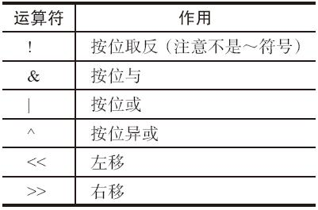

### 3.2 表达式

在Rust Reference中有这样一句话：

Rust is primarily an expression language.

Rust基本上就是一个表达式语言。“表达式”在Rust程序中占据着重要位置，表达式的功能非常强大。Rust中的表达式语法具有非常好的“一致性”，每种表达式都可以嵌入到另外一种表达式中，组成更强大的表达式。

Rust的表达式包括字面量表达式、方法调用表达式、数组表达式、索引表达式、单目运算符表达式、双目运算符表达式等。Rust表达式又可以分为“左值”（lvalue）和“右值”（rvalue）两类。所谓左值，意思是这个表达式可以表达一个内存地址。因此，它们可以放到赋值运算符左边使用。其他的都是右值。

#### 3.2.1 运算表达式

Rust的算术运算符包括：加（+）、减（-）、乘（\*）、除（/）、求余（%），示例如下：

---

```rust
fn main() {
    let x = 100;
    let y = 10;
    println!("{} {} {} {} {}", x + y, x - y, x * y, x / y, x % y);
}
```

---

在上面例子中，x+y、x-y这些都是算术运算表达式，它们都有自己的值和类型。常见的整数、浮点数类型都支持这几种表达式。它们还可以被重载，让自定义的类型也支持这几种表达式。运算符重载相关的内容会在第26章介绍标准库的时候会详细说明。

Rust的比较运算符包括：等于（==）、不等于（！=）、小于（<）、大于（>）、小于等于（<=）、大于等于（>=）。比较运算符的两边必须是同类型的，并满足PartialEq约束。比较表达式的类型是bool。另外，Rust禁止连续比较，示例如下：

---

```rust
fn f(a: bool, b: bool, c: bool) -> bool {
    a == b == c
}
```

---

编译时，编译器提示“连续比较运算符必须加上括号”：

---

```rust
$ rustc --crate-type rlib test.rs
error: chained comparison operators require parentheses
 --> test.rs:2:7
  |
2 |     a == b == c
  |       ^^^^^^^^^

error: aborting due to previous error
```

---

这也是故意设计的，避免不同知识背景的用户对这段代码有不同的理解。

Rust的位运算符具体见表3-1。

表 3-1



示例如下：

---

```rust
fn main() {
    let num1 : u8 = 0b_1010_1010;
    let num2 : u8 = 0b_1111_0000;

    println!("{:08b}", !num1);
    println!("{:08b}", num1 & num2);
    println!("{:08b}", num1 | num2);
    println!("{:08b}", num1 ^ num2);
    println!("{:08b}", num1 << 4);
    println!("{:08b}", num1 >> 4);
}
```

---

执行结果为：

---

```rust
$ ./test
01010101
10100000
11111010
01011010
10100000
00001010
```

---

Rust的逻辑运算符具体见表3-2。

表 3-2


取反运算符既支持“逻辑取反”也支持“按位取反”，它们是同一个运算符，根据类型决定执行哪个操作。如果被操作数是bool类型，那么就是逻辑取反；如果被操作数是其他数字类型，那么就是按位取反。

bool类型既支持“逻辑与”、“逻辑或”，也支持“按位与”、“按位或”。它们的区别在于，“逻辑与”、“逻辑或”具备“短路”功能。示例如下：

---

```rust
fn f1() -> bool {
    println!("Call f1");
    true
}

fn f2() -> bool {
    println!("Call f2");
    false
}

fn main() {
    println!("Bit and: {}\n", f2() & f1());
    println!("Logic and: {}\n", f2() && f1());

    println!("Bit or: {}\n", f1() | f2());
    println!("Logic or: {}\n", f1() || f2());
}
```

---

执行结果为：

---

```rust
$ ./test
Call f2
Call f1
Bit and: false

Call f2
Logic and: false

Call f1
Call f2
Bit or: true

Call f1
Logic or: true
```

---

可以看到，所谓短路的意思是：

·对于表达式A&&B，如果A的值是false，那么B就不会执行求值，直接返回false。

·对于表达式A||B，如果A的值是true，那么B就不会执行求值，直接返回true。

而“按位与”、“按位或”在任何时候都会先执行左边的表达式，再执行右边的表达式，不会省略。

另外需要提示的一点是，Rust里面的运算符优先级与C语言里面的运算符优先级设置是不一样的，有些细微的差别。不过这并不是很重要。不论在哪种编程语言中，我们都建议，如果碰到复杂一点的表达式，尽量用小括号明确表达计算顺序，避免依赖语言默认的运算符优先级。因为不同知识背景的程序员对运算符优先级顺序的记忆是不同的。

#### 3.2.2 赋值表达式

一个左值表达式、赋值运算符（=）和右值表达式，可以构成一个赋值表达式。示例如下：

---

```rust
// 声明局部变量,带 mut 修饰
let mut x : i32 = 1;

// x 是 mut 绑定,所以可以为它重新赋值
x = 2;
```

---

上例中，x=2是一个赋值表达式，它末尾加上分号，才能组成一个语句。赋值表达式具有“副作用”：当它执行的时候，会把右边表达式的值“复制或者移动”（copy or move）到左边的表达式中。关于复制和移动的语义区别，请参见第11章的内容。赋值号左右两边表达式的类型必须一致，否则是编译错误。

赋值表达式也有对应的类型和值。这里不是说赋值表达式左操作数或右操作数的类型和值，而是说整个表达式的类型和值。Rust规定，赋值表达式的类型为unit，即空的tuple（）。示例如下：

---

```rust
fn main() {
    let x = 1;
    let mut y = 2;
    // 注意这里专门用括号括起来了
    let z = (y = x);
    println!("{:?}", z);
}
```

---

编译，执行，结果为：（）。

Rust这么设计是有原因的，比如说可以防止连续赋值。如果你有x：i32、y：i32以及z：i32，那么表达式z=y=x会发生编译错误。因为变量z的类型是i32但是却用（）对它初始化了，编译器是不允许通过的。

C语言允许连续赋值，但这个设计没有带来任何性能提升，反而在某些场景下给用户带来了代码不够清晰直观的麻烦。举个例子：

---

```rust
#include <stdio.h>

int main() {
    int x = 300;
    char y;
    int z;
    z = y = x;
    printf("%d %d %d", x, y, z);
}
```

---

在这种情况下，如果变量x、y、z的类型不一样，而且在赋值的时候可能发生截断，那么用户很难一眼看出最终变量z的值是与x相同，还是与y相同。

这个设计同样可以防止把==写成=的错误。比如，Rust规定，在if表达式中，它的条件表达式类型必须是bool类型，所以if x=y{}这样的代码是无论如何都编译不过的，哪怕x和y的类型都是bool也不行。赋值表达式的类型永远是（），它无法用于if条件表达式中。

Rust也支持组合赋值表达式，+、-、\*、/、%、&、|、^、<<、>>这几个运算符可以和赋值运算符组合成赋值表达式。示例如下：

---

```rust
fn main() {
    let x = 2;
    let mut y = 4;
    y += x;
    y *= x;
    println!("{} {}", x, y);
}
```

---

LEFT OP=RIGHT这种写法，含义等同于LEFT=LEFT OP RIGHT。所以，y+=x的意义相当于y=y+x，依此类推。

Rust不支持++、--运算符，请使用+=1、-=1替代。

#### 3.2.3 语句块表达式

在Rust中，语句块也可以是表达式的一部分。语句和表达式的区分方式是后面带不带分号（；）。如果带了分号，意味着这是一条语句，它的类型是（）；如果不带分号，它的类型就是表达式的类型。示例如下：

---

```rust
// 语句块可以是表达式,注意后面有分号结尾,x的类型是()
let x : () = { println!("Hello."); };

// Rust将按顺序执行语句块内的语句,并将最后一个表达式类型返回,y的类型是 i32
let y : i32 = { println!("Hello."); 5 };
```

---

同理，在函数中，我们也可以利用这样的特点来写返回值：

---

```rust
fn my_func() -> i32 {
    // ... blablabla 各种语句
    100
}
```

---

注意，最后一条表达式没有加分号，因此整个语句块的类型就变成了i32，刚好与函数的返回类型匹配。这种写法与return 100；语句的效果是一样的，相较于return语句来说没有什么区别，但是更加简洁。特别是用在后面讲到的闭包closure中，这样写就方便轻量得多。
